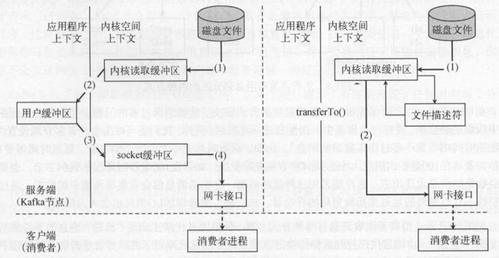

# 1 - Kafka 流式数据平台

Kafka = 消息系统 + 存储系统 + 流处理系统。

Kafka 首先是一个消息系统，用来处理系统解耦、异步调用和流量削峰等任务。

但是 Kafka 又提供了连接器与流处理的能力，也就是说能够对数据进行处理和统计。

## 1.1 消息系统

消息系统，或者消息队列，提供了数据的发布和订阅功能，主要有两种队列模式：**队列模式**和**发布-订阅模式**。

Kafka 通过消费组（consumer group）统一了这两种消费模型：

* 队列模式（点对点模式）

  多个消费者读取消息队列，每条消息只发给一个消费者。

  在此模式下，Kafka  会将消息平均分配给消费组中的成员。

  > 就是只创建一个消费组，消费组中的每个消费者各自订阅一个主题分区。

* 发布-订阅模式

  多个消费者订阅主题，主题的每条记录会发给所有的消费者。

  在此模式下，Kafka 可以将消息广播给多个消费组。这样每个消费组就能接受到消息队列内完整的记录。

  > 就是创建多个消费组，每个消费组订阅主题下的所有分区。

<figure>

  <figcaption>Fig.1-1 两种消息模式：队列模式和发布-订阅模式。</figcaption>
</figure>

## 1.2 存储系统

显然，如果想做到消息生产和消费的解耦，那么消息中间件必然需要持久化未被消费的消息。

Kafka 将数据写入到服务节点的磁盘，还会复制多份来保证出现故障时仍然可用。

为了保证消息的可靠存储，Kafka 生产者阻塞的等待某条消息，直到它完全被复制到多个节点上。

## 1.3 流处理系统

除了消息的生成、存储和读取之外，Kafka 还可以扮演流式数据平台的作用。

比如流的聚合、连接和各种转换。

# 2 - Kafka 的基本概念

## 2.1 分区模型

通常，不同的应用产生不同类型的数据，对应到不同的主题。同一个主题下可以有多个分区（partition）。

分区可以理解为一个有序的记录序列，序列中的每条消息会按照时间顺序分配一个单调递增的顺序编号，叫做偏移量（offset）。偏移量能够唯一的定位当前分区中的每一条消息。

下图可以看到分区的偏移量是从 0 开始的，并且每个分区维护自身的偏移量。

<figure>

  <figcaption>Fig.2-1 分区物理上是一个日志文件，每条消息会被分配一个自增的偏移量、时间戳和一些元数据。</figcaption>
</figure>

Kafka 使用主题分区作为消息处理的并行单元，一个分区只能被分配给一个消费组中的一个消费者。

这意味着：

* **有序性**：分区有序，消费者处理的消息就是有序的；
* **负载均衡**：不同的消费者处理不同的分区。

> 这里实际上只是在说一句话：Kafka  在分区的层面保证消息处理的顺序性。
>
> 能不能在主题层面实现消息有序呐？
>
> 1）只设置一个分区；或者
>
> 2）数据写入时携带 key，符合规则的 key  就会被分配到固定分区。

## 2.2 消费模型

推送模型（push）

消息系统记录消费者的消费状态，当消息被推送到消费者后，消息系统将这条消息标记为已消费。

也就是说需要消费者对一条消息进行 ACK 确认后，才能认为这条消息被消费了。

拉取模型（pull）

Kafka 采取了拉取模型，由消费者自行记录消息的消费状况。

拉取时，消费者通过分区 + 偏移量确定请求的消息，比如 p0 + 8，获取 p0 分区，偏移量为 8 的消息。

拉取模型带来的好处为：**消费者可以按照任意的消费顺序消费数据**。

> 比如说，消费者可以重置消费偏移量到旧的位置，重新消费旧数据。

<figure>

  <figcaption>Fig.2-2  拉取模型：消费者按照偏移量主动控制消费的顺序。</figcaption>
</figure>

拉取模型带来的问题
* 偏移量 offset 限制
  
  LSO（Log Start Offset）是可以消费的最小偏移量；
  
  最高水位 HW (HighWatermark) 限制了最高消费偏移量。
  比如说，如果生产者最新写入的消息还没有达到备份数目，那么对消费者不可见。
  
* 消息要存多久？
	
	因为消费者有可能重复消费旧的数据，所以无论数据是否被消费都会一直保存在 Kafka 集群中。
	可以设置过期时间清理过期的数据，比如两天，那么数据发布两天后就会被删除。

## 2.3 分布式模型

Kafka 层次：

* 主题层
	一个主题有 M 个分区，一个分区有 N 个副本；
	
* 分区层

  N 个分区副本中只有一个是 leader 副本，其他 N - 1 个是 follower 副本。

  主副本负责本主题的所有读写操作，备副本仅仅从主副本同步数据。每个服务端都会作为某些分区的主副本，已经另外分区的备份副本，为的是追求负载均衡。

  当主副本出现故障时，会从备副本中选择一台机器进行故障转移 failover。

* 消息层

  分区中包含若干消息，每条消息以单调递增的偏移量作为标识。

<figure>

  <figcaption>Fig.2-3  分区作为消费者线程模型的最小并行单位。</figcaption>
</figure>

# 3 - Kafka 的设计与实现
## 3.1 文件系统的持久化与传输效率

>将数据落到磁盘能够保证数据的持久化。但是如何解决磁盘读写效率低下的问题呐？
>
>本章节试图论证：针对磁盘的顺序访问，某些情况下会比随机访问内存快，甚至可以和网络的速度相差无几。

磁盘访问并不意味着读写性能的严重下降，Kafka 一直在努力提高 I/O 效率：

### 操作系统层面对磁盘读写的优化

* 预读（read-ahead）会提前将一个比较大的磁盘块读入内存；一般的策略就是顺序预读。
* 后写（write-ahead）会将很多小的逻辑写操作合并起来，组合成一个大的物理写操作；
* 磁盘缓存（disk/page cache）剩余的内存空间可以将磁盘缓存到内存中。

综合这几点内存优化，**磁盘的顺序访问，某些情况下会比随机访问内存快，甚至可以和网络的速度相差无几**。

### 消息写入的优化

* 生产者批量发送消息（而非每生产一个消息就发送到 Kafka）；
* Kafka  写入数据时只调用 `write` 而不调用 `fsync`，数据真正落到磁盘依赖系统行为（缓存时间足够长或者积攒的数据足够大了）。

<figure>

  <figcaption>Fig.3-1  应用程序数据写入到磁盘的两种策略：1）尽可能缓存数据，然后一次性落到磁盘；2）只 write 但是不主动同步。</figcaption>
</figure>

### 消息消费的优化

零拷贝技术（zero-copy）：减少复制次数，降低消费时延。

如此，**消息使用的速度基本上等于网络连接的速度**。

假设有 10  个消费者，传统的复制次数是 4 * 10 = 40 次；如果使用零拷贝技术只需要 1 + 10 次。

> 其中 1 表示从磁盘复制到页面缓存，另外 10 次表示 10 个消费者各自读取一次页面缓存。

<figure>

  <figcaption>Fig.3-2 数据复制方式对比。1）传统的数据复制方式需要 4 次拷贝；2）零拷贝技术只需要 2 次。</figcaption>
</figure>

## 3.2 生产者和消费者

> 讲的是分区路由和消费模型。

### 生产者

Kafka 的数据生产者直接将数据推送到 leader 分区副本，并不需要经过任何的中间路由层。

> 所有的消息代理节点都会保存一份元数据，记录了每个主题分区对应的主副本节点。
>
> 生产者发送消息之前需要请求消息代理节点的元数据，才能确定每条消息的目标节点。

主题下的消息如何确定目标分区？

分区路由的方式有两种：**轮询**或者**分区语义**。

<figure>

  <figcaption>Fig.3-3 分区路由方式。1）随机；2）分区语义，即根据键值进行分区。</figcaption>
</figure>
### 消费者

> 本质的区别就在于是谁记录消费的进度。

* **推送模型**需要知道消费者处理数据的进度，

为了确认发出的消息被消费者真正的消费了，消费者需要确认处理完毕的数据（应答/确认机制）。

应答机制可能会带来两个问题：

1）重复消费：消费者消费了某条消息，但是没有成功确认，这会导致消息被重复消费一遍；

2）一致性：消息代理需要记录每条消息的消费状态，这要求客户端和服务端做一致性保证；

推送模式的好处在于只有新数据产生才会推送给消费者，这样可以避免消费者轮询。

* **拉取模型**由消费者记录消费进度（偏移量），

1）消费者可以自行控制消费的进度（比如故意回退到旧的偏移点重新消费）；

2）消费者可以批量拉取数据；

这带来的一个问题是消费者无法知知道消息代理的消息状态，需要不断的轮询，等待消息的到来。

可能解决一个办法是消费者请求以阻塞式、长轮询的方式等待。

<figure>

  <figcaption>Fig.3-4 消费者获取消息的两种模型：1）推送模型和 2）拉取模型。</figcaption>
</figure>

## 3.3 副本机制和容错处理

副本机制：一个主题有多个主题分区，每个主题分区有多个副本，分区副本分布在不同的节点上。

分区副本又被划分为 leader 副本和 follower 副本。

1）leader 副本负责对应主题分区的所有读写请求；

2）follower 副本保持和 leader 副本的同步；

3）如果 leader 副本出现故障，则某个 follower 副本将顶上成为 leader 副本。

follower 副本总是尽量的和 leader 副本的数据保持一致。

根据 follower 副本 follow 的进度，可以将它们划分为：**ISR（In-Sync-Replicas）**和 **OSR（Out-Sync-Replicas）**。

可以认为 ISR 中的副本数据很好地和主副本保持了一致，如果进度丢失过多，那么就会被划分到 OSR。

> ISR  的一个成员就是 leader 分区副本。
>
> OSR 的副本如果争气，赶上了进度，那么就会被提升到 ISR 集合。

ISR 和 OSR 可以用来回答两个问题：

* 生产者如何确认消息已经成功提交？

  在 Kafka 中，一条消息只有被 ISR 中的所有副本应用到本地文件，才认为成功提交。

  > 目前可以自行设置同步副本的次数？

* leader 副本故障，如何挑选替代者？

  从 ISR 中选择。

leader 副本负责读写，follower 副本不对外提供服务，优点在于：

1）"read your write"：如果消息提交成功，那么能保证你一定能消费到；

2）"monotonic reads"：单调读，消费消息时，保证读到的数据下次还能读到。

