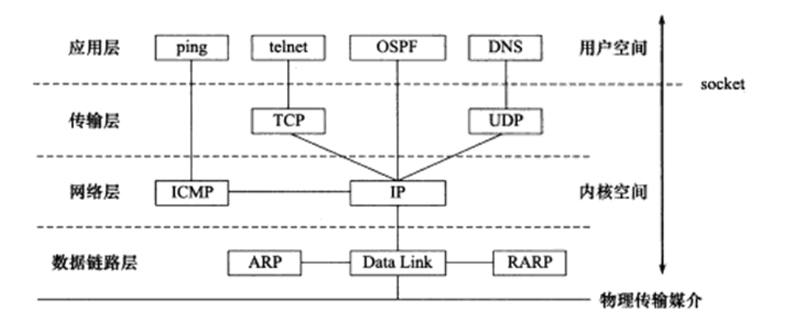
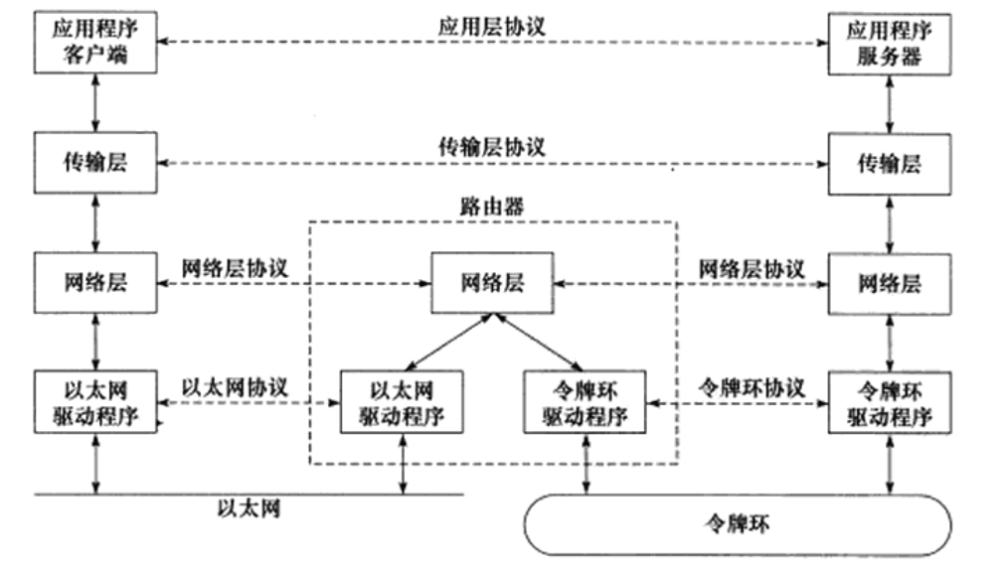
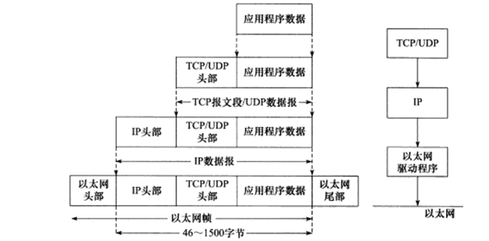
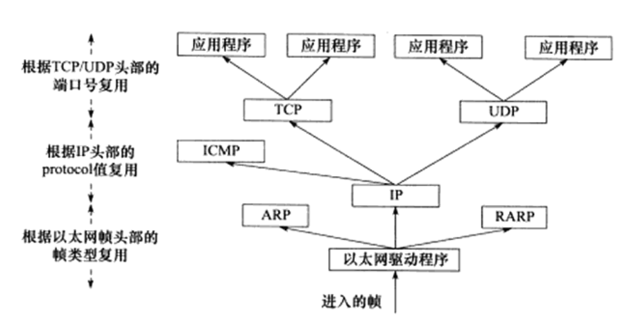
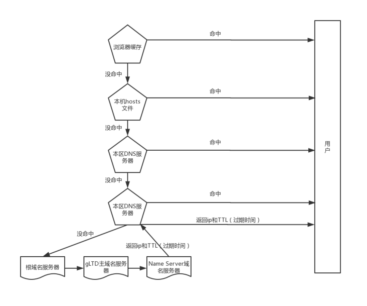
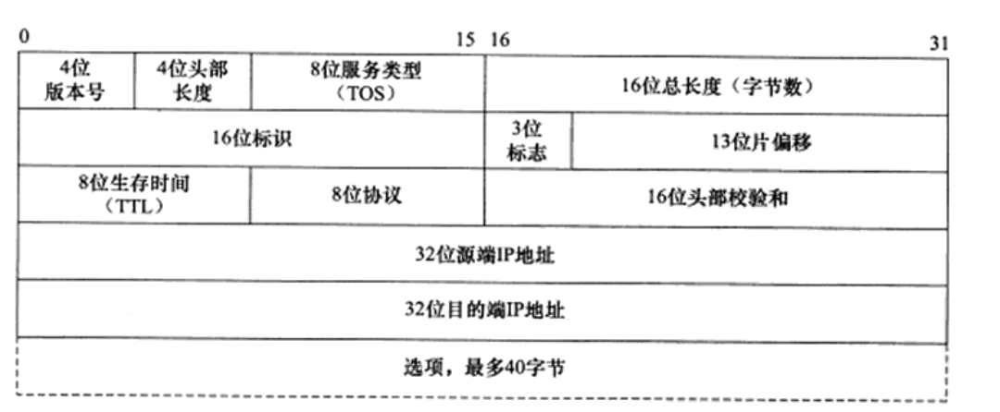
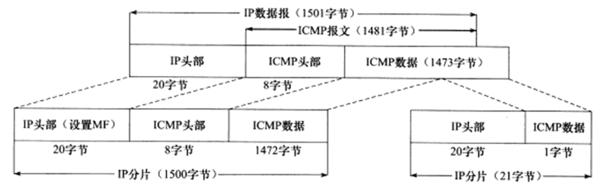
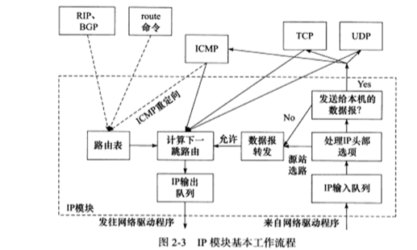
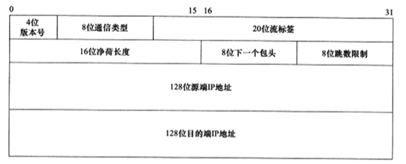

# 1TCP/IP协议族

## TCP/IP 协议族体系结构

  <figure>
    
    <figcaption>Fig. 1-1 四层协议族及主要协议。</figcaption>
  </figure>


* 数据链路层

  实现了网卡接口的网络驱动程序，以处理数据在物理媒介上的传输。

  > 隐藏物理网络的电气特性，提供统一接口。

  主要协议：

  **ARP地址解析协议**：解析IP地址 from 物理地址（MAC）；

  **RARP逆地址解析协议**：解析物理地址 from IP 地址；

  网络层使用IP地址寻址一台机器，数据链路层使用物理地址寻址一台机器。

* 网络层

  实现数据包的选路(routing)和转发。

  > WAN(Wide Area Network)通常选用分级的路由器来连接分散的主机和LAN(Local Area Network)；
  >
  > 因此两台主机通常并不是直接相连，而是通过多个中间节点（路由器）连接的；
  >
  > 网络层的任务就是选择这些节点，以确认通信的路径。
  >
  > 同时，对上层隐藏了通信的细节，上层看来通信双方是直接相连的。

  主要协议：

  **IP协议**：internet protocol，根据数据包的IP地址来决定如何投递。

  > 如果数据包不能直接发给对方主机，那么IP协议就会寻找合适的下一跳路由器，并将数据包交给该路由器转发。
  >
  > 多次重复这一过程，直到数据最终到达对方主机或者被丢弃。

  **ICMP协议**:internet control message protocol，因特网控制报文协议，主要用于检测网络连接。
  根据用途可以分为两类：差错报文和查询报文。前者用来回应网络错误(tracert用于查看网络丢包和延时)，后者用来查询网络信息（如ping用来查询报文是否可达）

  > ICMP 提供了IP提供的服务。

* 传输层

  为两台主机提供端到端（end to end）的通信。

  > 传输层是boss，只关注最终的结果，不考虑数据包的中转细节。

    <figure>
      
      <figcaption>Fig. 1-2 传输层和网络层的区别，虚线表示逻辑通信线路，实线表示真实的通信线路。</figcaption>
    </figure>

  主要协议：

  **TCP协议**：transmission control protocol，传输控制协议。为应用层提供**可靠的**，**面向连接的**，**基于流**(stream)的服务。

  > 可靠的：说的是确保数据被正确的发送到目的端，使用手段是超时重传 + 数据确认等方式。
  >
  > 面向连接的：使用该协议的双方必须先建立TCP连接，这种连接是全双工的，通信结束后再关闭。
  >
  > 基于流的：数据如同流水一般，没有边界感，从连接的一端逐个字节写入，另一端逐个字节的读出。

  **UDP协议**：user datagram protocol，用户数据包协议，为应用层提供**不可靠的**，**无连接**和**基于数据报**的服务。

  > 不可靠：不保证数据被正确的发送到目的端，如果数据中途丢失或者目的端校验错误，则发送方只会简单通知对方发送失败。
  >
  > 因此用户程序需要自己实现超时重传和数据确认等逻辑。
  >
  > 无连接的：双方不保持一个长的连接，每次发送数据都需要重新指定目的端的地址。无连接的特性非常适合多播和广播。
  >
  > 基于数据报：每个UDP数据报都有一个长度，接收方必须以该长度为最小单位将内容一次性读出。

* 应用层

  负责处理应用程序的逻辑。

## 封装和分用

封装(encapsulation)：上层使用下层服务的方式。

> 比如说当send函数被调用的时候，数据从用户控件复制到TCP内核发送缓存区，然后调用IP模块提供的服务。
> UDP也是类似，UDP发送后就会清楚内核数据，如果发送失败，应用需要重新拷贝发送。

帧frame是最终在物理网络上传送的字节序列，帧最多能携带的上层协议数据称为MTU(max transmit unit)，最大传输单元。

如果超过上限，则IP数据报将会被分片传输。

  <figure>
    
    <figcaption>Fig. 1-3 下层并不会修改上层的内容，而是在头尾加上本层的内容。</figcaption>
  </figure>

分用(demultiplexing)：数据到达目的主机后，由下往上各协议层解析获取各自所需信息，并最终将数据交给应用层的过程。

下层如何准确的将数据传递给上层正确的协议/应用？

  <figure>
    
    <figcaption>Fig. 1-4 以太网帧的分用过程。</figcaption>
  </figure>


## DNS工作原理

> 可惜的是，我们通常是用域名来访问机器，而不是直接使用IP地址，那么机器的域名如何对应到IP地址？

**DNS**: distributed name service，分布式的名字服务，存放着大量的机器名和IP地址的映射，并且是动态更新的。

  <figure>
    
    <figcaption>Fig. 1-5 域名解析的过程。</figcaption>
  </figure>
# 2 - IP 协议详解

IP服务特点：**无状态**，**无连接**，**不可靠**。

* 无状态

  所有IP数据报发送、传输和接收都是相互独立的，没有上下文关系。

  接收端的IP模块只要接收到完整的IP数据报（IP分片的话会先组装）就将其数据部分（TCP报文段、UDP数据报和ICMP报文）交给
  上层协议。从上层协议来看，接收到的就可能是乱序的、重复的。

  优点是：简单，高效。

* 无连接

  IP通信双方都不长久地维持双方的任何信息，这样上层协议每次发送信息的时候都必须重新支持IP地址。

* 不可靠

  不能保证IP数据报准确的到达目的端，只是承诺尽最大努力。

  IP协议如果检测到IP数据报发送失败，就通知上层协议，并不会重传。

  上层协议必须自己实现数据确认，超时重传等机制。

  > 可能的发送失败原因：
  >
  > 1）中转的路由器发现IP数据报存活时间TTL太长了，就会直接丢弃，并返回一个ICMP错误(超时错误)给发送方；
  >
  > 2）接收端发现接收到的IP数据报校验不正确，将丢弃并返回一个ICMP错误(IP头部参数错误)给发送方；

## IP头部信息

出现在每个IP数据报中，用于指定源端和目的端的IP地址，指导IP分片和重组以及指定部分通信行为。

每行32bit，也就是4个字节。五行，一般情况下IP头部是20个字节。最多可以达到60字节。
16为总长度就是IP数据报携带的数据，最大是65536。但是会受到MTU的限制，超过就会被分片。

第二行描述的就是分片信息，数据报的唯一标识，同一数据报的多个分片共享一个标识。
3位标识描述是否分片DF/MF，片偏移指的是相对于原始IP数据报携带数据的开始处的偏移量。

  <figure>
    
    <figcaption>Fig. 2-1 IP协议头部结构。</figcaption>
  </figure>

  <figure>
    
    <figcaption>Fig. 2-2 ICMP的IP数据报的分片， MTU为1500，注意到第二分片没有携带头部信息。</figcaption>
  </figure>

## IP数据报的路由和转发

决定数据报是否应该转发以及如何转发。

  <figure>
    
    <figcaption>Fig. 2-3 IP模块基本工作流程。IP协议的核心任务就是数据报的路由，即决定发送数据报到目标机器的路径。实线表示IP数据报的处理过程，虚线表示路由表的更新过程。</figcaption>
  </figure>

可以看到接收到IP数据报之后，会判断是发给本机还是进行转发。

> 接收到数据报首先还是进行CRC的校验。
>
> 如果数据报的头部的IP地址是本机的某个IP地址或者是广播地址，则可确定该数据是发给本机的。通过头部的协议字段确实来决定分发给哪个上层应用。
>
> 否则就准备准发该IP数据报。

## IPv6头部结构*

  <figure>
    
    <figcaption>Fig. 2-4 IPv4固定头部结构。IPv6解决了IPv4地址不足的问题，此外还引进了很多功能。</figcaption>
  </figure>
# 3 - TCP协议详解

TCP和UDP服务的特点与比较。

TCP协议相对于UDP协议的特点：**面向连接的**、**字节流**和**可靠传输**。

* **面向连接**：

  1）使用TCP协议通信的双方必须先建立连接（双方为连接分配不要的内核资源，方便管理连接的  状态和连接上数据的传输），然后才能开始数据的读写；

  2）TCP连接是全双工的，即双方的数据读写是可以通过一个连接进行。

  3）完成数据交换之后，通信双方都必须断开连接以释放系统资源。所以基于广播和多播的应用程序不能使用TCP服务，而无连接的UD协议则非常适合多播和广播。

* **字节流服务和数据报服务的区别**：

  字节流服务的发送端执行的写操作次数和接收端执行的读操作次数之间是没有任何数量关系的，同样读写的次数和TCP报文段个数之间也没有固定的数量关系。

  UDP则不然。发送端每执行一次写操作，UDP模块就将其封装成一个UDP数据报并且发送之。接收端必须及时针对每一个UDP数据报执行读操作，否则就会丢包。如果应用程序没有足够的缓冲区来读取UDP数据，则UDP数据将被截断。

  <figure>
    
    <figcaption>Fig. 3-1 TCP字节流服务。读写和报文段的数目没有直接的关系。</figcaption>
    
    <figcaption>Fig. 3-2 UDP数据报服务。一次读或者写对应一个UDP报文。</figcaption>
  </figure>

* **TCP是可靠的**

  1）TCP协议采用发送应答机制，发送端的每个TCP报文段都必须得到接收方的应答，才认为这个TCP报文段传输成功。

  2）超时重传机制。发送端每发出一个TCP报文段之后启动定时器，如果在定时时间内没有收到应答，报文段就会被重发。

  3）因为TCP报文段最终是以IP数据报发送，IP数据报的接收端可能是乱序、重复的，所以TCP协议还需要对接收到的TCP报文段进行重排、整理，才会交付到应用层。

  UDP协议和IP协议一样，提供不可靠服务。上层协议需要自行进行数据确认和超时重传。

## TCP头部信息

TCP头部信息出现在每个TCP报文段，用于指定通信的源端端端口号、目的端端口号，管理TCP连接，控制两个方向的数据流。

<figure>
  
  <figcaption>Fig. 3-3 TCP头部结构。注意这里只有端口号，IP是在IP数据报加上的。</figcaption>
</figure>

**32位序号**：一次TCP通信（从TCP连接到断开）过程中，某一个传输方向上的字节流的每个字节的编号。

> 比如主机A -> 主机B，开始通信时系统给定一个随机值ISN，随后在该传输方向上，序号值会被系统设置为ISN加上该报文段锁携带数据的第一个字节在整个字节流中的偏移。比如某个TCP报文段传送的数据是字节流中的第1024~2048字节，则序号值为ISN + 1024。

**32位确认号**：用作对另一方发送来的TCP报文段的响应，值等于期望收到的下一个字节的序号。

> 因此，A发送给B的TCP报文段，不仅包含了本次发送的序号值，还有对B发送报文的确认。
>
> 所谓的期望其实就是当前的序号seq + 本次接收到的字节数 + 1。

**4位头部长度**：标识该TCP头部有多少个32bit字（4字节）。所以TCP头部最长就是60字节。

**6位标志位**：

1）**SYN**标志，表示请求建立一个连接，携带SYN标志的TCP报文段被称之为**同步报文段**。

2）**ACK**标志，表示确认好是否有效，携带ACK标志的TCP报文段被称之为**确认报文段**。

3）**FIN**标志，表示通知对方本端要关闭连接了，携带FIN标志的TCP报文段被称之为**结束报文段**。

4）**URG**标志，表示**紧急指针**是否有效。

5）**PSH**标志，提示接收端应用程序应该立即从TCP接收缓存区中读走数据，为接收后续数据腾出空间。

6）**RST**标志，表示要求对方重新建立连接，携带RST标志的TCP报文段被称之为**复位报文段**。

**16位窗口大小**：是TCP流量控制的一个手段。这里指的是**接收通知窗口RWND**，RWND告知对方，本端的TCP接收缓冲区还能容纳多少字节的数据，方便对方控制发送数据的速度。

**16位紧急指针**：偏移量，用于描述紧急数据的位置。这是发送端向接收端发送紧急数据的方法。

### TCP头部选项

头部选项在连接初始化和实际工作的时候都有可能被用到。

* TCP连接初始化（只能出现在同步报文段**SYN**中）

  kind = 2，最大报文段MSS(max segment size)选项，一般设置为`MTU-40`，40是TCP头部的20字节加上IP头部的20字节，这样可避免被分片。

  kind = 3，窗口扩大因子选项，数值表示左移位数。16位窗口大小只能表示65536，实际上RWND远不止这个数。

  kind = 4，选择性确认SACK(selective ACK)。TCP通信时如果某个报文段丢失，则TCP模块会重传最后被确认的TCP报文段的后续的所有报文段，这样原先已经正确传输的TCP报文段也可能重复发送。SACK允许只重新发送丢失的报文段。

* 实际工作

  kind = 5，与SACK配合，告知发送端需要重新发送的报文段的范围，两个沿之间表示没有接收到的数据。

  kind = 8，时间戳选项，提供了通信双方的回路时间RTT（round trip time)，为TCP流量控制提供重要参考信息。

<figure>
  
  <figcaption>Fig. 3-4 TCP头部选项。kind（1字节）表示选项类型，length（1字节）指定该选项的总长度，info是选项的具体信息。</figcaption>
</figure>

## TCP状态转移过程

TCP连接的两端都是一个状态机。在TCP连接从建立到断开的整个过程中 ，连接两端的状态机将经历不同的状态变迁。

<figure>
  
  <figcaption>Fig. 3-5 TCP连接和断开的过程中客户端和服务端的状态变化。</figcaption>
</figure>

* 半关闭状态

  TCP连接是双工的，所以允许两个方向的传输数据被独立关闭。就是一端可以发消息给另一端，自己的数据已经传输完毕，不再发送；但是仍可以接收来自对方的消息，直到对方也发送关闭报文。

* 连接超时

  建立连接时，如果超时会怎么办？答案是不断的重连，每次重连的间隔逐渐增大（翻倍），直到最后放弃。

### TCP状态与socket函数之间的关系

* 服务器端的listen系统调用

  服务器通过listen系统调用进入**LISTEN**状态，被动等待客户端连接。服务器一旦接收到某个连接请求（收到同步报文段），就将该连接放入内核等待队列，向客户端回复ACK确认报文段，此时该连接处于**SYNC_RCVD**状态。客户端收到并且回复ACK，则连接进入**ESTABLISHED**状态，双方可以进行数据传输。

* 客户端的connection

  客户端通过connection系统调用，主动与服务端建立连接，此时客户端连接进入**SYNC_SENT**。

  如果收到来自服务端的SYNC+ACK报文段，则连接进入**ESTABLISHED**状态。

  connection可能会失败，使得连接进入**CLOSE**状态：

  1）目标端口不存在（没有被应用程序监听），或者该端口仍被处于**TIME_WAIT**状态的连接所占据。服务端会发送一个复位报文段，连接失败。

  2）目标端口存在，但是未在规定时间内接收到回复，也就是连接超时了。

* 客户端主动关闭close或者shutdown

  客户端执行主动关闭时，将向服务端发送一个结束报文段，状态转移到**FIN_WAIT_1**。

  此时如果接收到服务端的确认报文段，服务端进入**CLOSE_WAIT**的状态，则客户端连接状态进入**FIN_WAIT_2**；**FIN_WAIT_2**的作用是继续接受来自服务端的未传完的数据，此时了解进入半关闭状态。

  如果服务器端发送FIN+ACK的报文段，服务端连接进入到**LAST_ACK**状态，客户端的连接状态转移至**TIME_WAIT**;

  考虑两个case：

  1）case1：**FIN_WAIT_1**可以直接转移到**TIME_WAIT**，如果服务端直接回复FIN+ACK报文。

  2）case2：处于**FIN_WAIT_1**的连接客户端连接迟迟接收不到来自服务端的结束确认报文（服务端直接退出了），则客户端连接编程孤儿连接。内核指定了孤儿连接的数目和生存时间。

### TIME_WAIT状态

处于**FIN_WAIT_2**的连接接受到结束确认报文段，回复ACK后得等待2**MSL**（maximum segment life)  才能完全关闭。

MSL是报文最大生存时间，大概是2mins。原因有两点：

1）可靠的终止TCP连接。比如说客户端回复的ACK报文段丢失了，那么服务端会重发FIN+ACK报文段，此时客户端能正常处理。（直接退出客户端会回复复位报文段，服务器会认为这是一个错误）

2）保证迟来的TCP报文段被识别并且丢弃。处于**TIME_WAIT**的端口号，无法被打开多次，也就是无法被其他连接占据。否则，假设建立了一个新的连接，该连接和原来连接有着相同的IP地址和端口号。那新连接就有可能接收到上一次连接的报文，这显然是不该发生的。为什么等待2MSL？这样两个方向上的报文段都会完全失效。

socket选项**SO_REUSEADDR**可以允许进程强制使用处于time_wait的端口号。（比如进程重启后，可以再次使用上次的端口号）

  

<figure>
  
  <figcaption>Fig. 3-6 TCP状态转移过程。</figcaption>
</figure>
### 复位报文段

复位报文段用于通知对方关闭连接或者重新建立连接。

* 访问不存在的端口

  当目标端口不存在或者仍处于**TIME_WAIT**状态的时候，会回复复位报文段。

* 异常终止连接

  终止一个异常的连接，如果发送复位报文段，发送方所有排队的报文段都会被丢弃。

  类似选项**SO_LINGER**。

* 处理半打开状态。

  半打开：服务端关闭了连接，客户端没有接收到终止报文（比如网络故障），服务器端即使重启，也没有该连接的任何信息。

  如果此时往半打开状态的连接写数据，则将接收到一个复位报文段。

## TCP数据流

两种典型的TCP数据流：交互数据流和成块数据流。还有一种特殊的数据：紧急数据。

数据按照长度可以分为交互数据和成块数据，交互数据对实时性要求高（如telnet、ssh)，成块数据对传输效率要求高（如ftp)。

带外数据：用于迅速通知对方本端发生的重要的事情。因此带外数据有较高的优先级。

## TCP数据流的控制

为了保证可靠传输和提高网络通信质量，内核需要对TCP数据流进行控制。
在异常网络状态下（超时或者丢包），讨论TCP数据控制的两个方面：超时重传和拥塞控制。

### 超时重传

TCP为每个报文段都设置了一个重传定时器，当TCP报文段被第一次发送时，定时器启动，当超时时，报文段将会被重传。

这里主要讨论重传的超时时间如何设置，以及重传的次数。

重传时间：0.2 - 0.4 - 0.8 - 1.6 -3.2s；

重传次数：最小重传次数3-最大重传次数15；// 见 /proc/sys/net/ipv4/tcp_retries[1,2]

超时会触发超时重传，但是TCP报文可以在超时之前就主动重传，即**快速重传**。

### 拥塞控制

讲的是TCP协议评估网络情况，提高网络利用率，降低丢包率，并保证网络资源对每个数据流的公平。

每个发送方根据所感知到的网络拥塞情况，来限制其能向该连接发送流量的速率。

这句话其实提出了三个问题：

1）如何限制发送流量的速率？

拥塞窗口CWND（congestion window)，它对TCP发送方能向网络中送流量的速率进行了限制。

这是一个额外引入的变量，和其他变量的关系如下：

$LastByteSend - LastByteAck \le min \{CWND, RWND\}$

2）发送方是如何感知网络拥塞情况的？

丢包事件：超时或者收到来自接收方的三个冗余ACK。

当出现过度拥塞的时候，路由器的缓存会溢出，导致数据报被丢弃，触发丢包事件。

3）当感知到拥塞的时候，采用什么算法来改变其发送速率？

这便是TCP拥塞控制算法。其基本思想是当出现丢包时间时就降低发送速率，当察觉到网络无拥塞的时候增大发送速率。

下面主要讨论TCP reno算法。

* 慢启动和拥塞避免

  当一个TCP开始的时候，CWND的值被设置为一个MSS，这个值可能远小于可用带宽。因此TCP发送方没经过一个RTT时间，就将CWND的值翻倍，也就是以指数的形式增加，直到发生一个丢包事件为止（或者有一个慢启动门限？）该算法被称之为慢启动，是因为发送方以一个较慢的发送速率启动，然后指数增加。

  总之当丢包发生或者触达慢启动门限时，进入到线性的拥塞避免算法阶段。

  线性增加多少合适？

  1）$CWND  += min\{N, MSS\}$，N是此次确认中包含的之前未被确认的字节数。

  2）$CWND += MSS * MSS / CWND$

* 快速重传和快速恢复

  以上讨论的是拥塞尚未发生时的积极避免拥塞的方法。快速重传和快速恢复讨论的是发生拥塞时的策略。

  快速重传：快重传要求**接收方**在收到一个失序的报文段后就立即发出重复确认（为的是使发送方及早知道有报文段没有到达对方，可提高网络吞吐量约20%）而不要等到自己发送数据时捎带确认。快重传算法规定，**发送方**只要一连收到三个重复确认就应当立即重传对方尚未收到的报文段，而不必继续等待设置的重传计时器时间到期。

  快重传配合使用的还有快恢复算法，有以下两个要点：

  1）当发送方连续收到三个重复确认时，就执行“乘法减小”算法，把ssthresh门限减半（为了预防网络发生拥塞）。但是接下去并不执行慢开始算法。
  2）考虑到如果网络出现拥塞的话就不会收到好几个重复的确认，所以发送方现在认为网络可能没有出现拥塞。所以此时不执行慢开始算法，而是将cwnd设置为ssthresh减半后的值，然后执行拥塞避免算法，使cwnd缓慢增大。

  > 快速恢复的快速是针对什么而言的？
  >
  > 其实一开始无论是遇到超时还是三个冗余确认，CWND都会被降到1个MSS，然后执行慢启动算法。
  >
  > 但是一些有识之士认为，这两种行为不能一概而论。能收到三个冗余确认，说明整个网络的情况还是可以的，应该降到现有阈值的一半，然后拥塞控制算法线性增加窗口。这里降到一半而非1个MSS就体现了快速二字。

# 8 - 高性能服务器框架

## Reactor 与 Proactor 模型

网络设计模型，同步 I/O 模型通常用于实现 Reactor 模型，异步 I/O 模型通常用于实现 Proactor 模式。

### Reactor 模式

主线程只监听文件描述符上是否有事件发生，有的话就立即将该事件通知工作线程。除此之外，主线程不作任何实质性的工作。

工作线程负责**接收新的连接**、**读写数据**以及处理客户请求。

实际工作流程如下：

1）主线程往 epoll  内核事件表中注册 socket 的读就绪事件；

2）主线程调用 epoll_wait 等待 socket 上有数据可读；

3）当 socket 上有数据可读的时候，epoll_wait 通知主线程。主线程将 socket 可读事件放入请求队列；

4）某个工作线程被唤醒，它从 socket 上读取数据，并处理客户请求，然后往 epoll  内核事件表中注册该 socket 上的写就绪事件；

5）主线程调用 epoll_wait 等待 socket 可写；

6）当 socket 可写时，epoll_wait 通知主线程。主线程将 socket 可写事件放入请求队列；

7）某个工作线程被唤醒，它往 socket 上写入服务器处理客户请求的结果；

<figure>
  
  <figcaption>Fig. 8-1 Reactor 模式。</figcaption>
</figure>


### Proactor

Proactor 模式下将所有的 I/O 操作都交给主线程和内核来处理，工作线程仅仅负责业务逻辑。

借助异步 I/O 模型，Proactor 工作流程如下：

1）主线程调用 aio_read 函数向内核注册 socket 上的读完成事件，并告诉内核读缓冲区的位置，以及读操作完成时如何通知应用程序；

2）主线程继续处理其他逻辑；

3）当 socket 上的数据被读入用户缓冲区的时候，内核将向应用程序发送一个信号，以通知应用程序数据已经可用；

4）应用程序预先定义好的信号处理函数选择一个线程处理客户请求。工作线程处理结束后，向内核注册 socket 的写就绪事件，并告诉内核写缓冲区的位置，以及写操作完成时如何通知应用程序；

5）主线程继续处理其他逻辑；

6）当用户缓冲区中的数据被写入 socket 的时候，内核将向应用程序发送一个信号，以通知应用程序数据已经发送完毕；

7）应用程序预先定义好的信号处理函数选择一个线程进行善后工作，比如决定是否关闭 connect。

<figure>
  
  <figcaption>Fig. 8-2 Proactor 模式。</figcaption>
</figure>

# 9 - I/O复用

I/O模型对比

| I/O模型   | 读写操作和阻塞阶段                                           |
| --------- | ------------------------------------------------------------ |
| 阻塞I/O   | 程序阻塞于读写函数                                           |
| I/O复用   | 程序阻塞于I/O复用系统调用（可以设置等待时间），但可同时监听多个I/O事件，对I/O本身的读写是非阻塞的 |
| SIGIO信号 | 信号触发读写就绪事件，用户程序执行读写操作，程序没有阻塞阶段 |
| 异步I/O   | 内核执行读写操作并触发读写完成事件，程序没有阻塞             |

* 什么是同步I/O？

  阻塞I/O、I/O复用和信号驱动I/O都是同步I/O模型，因为I/O的读写操作都是在I/O事件发生之后由应用程序完成的。应用程序需要显式的将数据在用户缓冲区和内核缓冲区之间搬运。

  POSIX定义的异步I/O模型，指的是内核接管I/O的读写（缓冲区已经由用户指定），然后通知用户读写就绪。

* 阻塞I/O

  accept、connection、recv和send默认是阻塞I/O。

  非阻塞I/O不管事件是否发生都会立即返回，如果事件没有发生则返回-1。需要根据errno来区分出错还是事件未发生。

  对accept、send和recv而言，EAGAIN和EWOULDBLOCK表明事件尚未发生；

  对connection而言，errno会被设置为EINPROGRESS。

* SIGIO信号

  可以为一个文件描述符指定宿主进程，当文件描述符上有时间发生时，进程会接收到SIGIO事件。

* I/O复用的概念

  应用程序通过I/O复用函数注册关注的事件，内核通过I/O复用函数把就绪的时间通知给应用程序。

## 三个I/O复用函数

```C
int select(int nfds, fd_set* readfds, fd_set* wtitefds, fd_set* exceptfds, truct timeval* timeout);
// readfds, writefds和exceptfds分别表示可读、可写和异常的(比如带外数据)fds
// fdset可以理解为一个数组，大小是1024
// nfds 指定被监听的文件描述符的总数
// timeout就是监听时间，null表示一直阻塞，直到有事件就绪
// 函数最终返回就绪的fd数。

/*
1) 每次调用select，都需要用FD_SET重置fd_set，因为内核会修改这个变量；
2）返回后需要遍历fd_set，用FD_ISSET判定fd是否就绪
*/
```

```C
int poll(struct pollfd* fds, nfds_t nfds, int timeout);
struct pollfd {
  int fd;  // 文件描述符
  short events;  // 注册的事件
  short revents;  // 实际发生的事件，由内核填充
};
// fds 关注的fd，数组形式传入；
// nfds 数组大小；
// -1表示永久阻塞直到有事件就绪

/*
1）大小不再受限；
2）关注的事件现在可以集中在一起啦，并且不需要每次重置
3）返回后仍旧需要遍历一遍fds才能定位就绪事件
*/
```

```C
/*
1）epoll使用一组函数来完成任务，而非一个；
2）epoll在内核中维持一个描述符列表，这样就不需要在用户和内核空间来回传递数据；当然也配备了相应的函数来修改内核描述符
3）epoll需要一个额外的文件描述符epollfd
*/

int epoll_create(int size);  // 返回一个epollfd，size参数不起作用，只是提示内核表有多大
int epoll_ctl(int epfd, int op, struct epoll_event* event);  // 内核表操作函数
// op 可以使ADD、MOD和DELETE
// event参数指定事件
struct epoll_event {
  __uint32_t events; // epoll事件
  epoll_data_t data; // 联合体，存放fd，或者data
};

int epoll_wait(int epfd, struct epoll_event* events, int maxevents, int timeut);
// maxevents 指定最多监听的事件
// events是输出参数，当检测到事件就绪时，就将就绪的时间从内核时间表拷贝到此变量，也就不再需要遍历fd
```

* EPOLL ET vs. LT

  LT（level trigger）：水平触发，当文件描述符采用LT时，epoll_wait检测到该文件描述符上有事件就绪将会通知应用程序，应用程序可以不处理(比如read没有完全读完)，当下次调用epoll_wait时，该事件还是会被报道，直到该事件被处理。该模式为默认模式。

  ET（edge trigger）：边缘触发，当epoll_wait检测到有事件就绪并且通知到应用程序时，应用程序必须立即处理；因为后续的epoll_wait不会再通知。该模式效率较高。

* EPOLL_ONESHOT

  当某个文件描述符被交付到一个工作线程时，如果该文件描述符上又有新的时间就绪，这时可能会被交付到另一个线程上处理。也就是说一个socket可能被两个线程同时操作。

  EPOLLONESHOT最多触发一个事件（可读、可写或者异常）并且只触发一次。

  这样能保证工作线程处理过程中不会有新的事件就绪。

  注意，处理完成后需要重置该socket上的EPOLLONESHOT标志，以确保下次可读。

* 三组I/O复用函数的比较

| 系统调用                             | select                                                       | poll                                                         | epoll                                                        |
| ------------------------------------ | ------------------------------------------------------------ | ------------------------------------------------------------ | ------------------------------------------------------------ |
| 事件集合                             | 用户通过三个参数注册感兴趣的可读、可写和异常事件；<br />内核通过对着三个参数的修改来反馈就绪事件，<br />因此用户每次调用select都要重置这三个参数 | 统一处理所有事件类型，用户只需要一个事件集参数；<br />用户通过pollfd.event传入感兴趣的事件，<br />内核通过修改pollfd.revents反馈真实发生的事件； | 内核通过一个时间表直接管理所有的事件；<br />因此用户不需要返回传入感兴趣的文件描述符集合 |
| 应用程序索就绪文件描述符的时间复杂度 | O(n)                                                         | O(n)                                                         | O(1)                                                         |
| 最大支持文件描述符数                 | 1024                                                         | 65535[^1]                                                    | 65535                                                        |
| 工作模式                             | LT                                                           | LT                                                           | 支持高效的ET模式                                             |
| 内核实现和工作效率                   | 采用轮询来检测就绪事件，O(n)                                 | 采用轮询来检测就绪事件，O(n)                                 | 采用回调函数来检测就绪事件[^2]，O(1)                         |

[^1]:系统允许的最大描述符的数目，epoll同；
[^2]:内核检测到就绪事件时，将触发回调函数，将就绪事件对应的文件描述符插入到内核就绪事件队列，内核在适当时机将该事件就绪队列中的内容拷贝到用户空间。这样就避免了轮询。

# 13 - 多进程编程

## 进程复制与替换

* fork系统调用`pid_t fork(void)`

  `fork`函数调用一次返回两次。在父进程中返回子进程的pid，在子进程中返回0。

  `fork`函数赋值当前进程，子进程的代码与父进程代码完全一致，同时会复制父进程的数据（堆、栈和静态数据）。数据的复制采用了写时复制（COW即只有任一进程对数据执行写操作时，复制才会真的发生）。此外，父进程打开的文件描述符，根目录和当前工作目录等变量都会被复制，且引用计数+1。

* `exec`系统调用

  子进程调用`exec`，替换当前进程映像，执行其他程序。调用一次不再返回，其身后的代码不再被执行。

* 处理僵尸进程

  当子进程结束时，内核不会立即释放该进程的进程表表项，以满足父进程对子进程退出信息的查询。

  僵尸态：子进程结束运行，父进程尚未/没有正确处理子进程的退出信息时，子进程被称之为僵尸进程。

## 进程间通信方式

ipcs可以查看系统上存在的共享内存，信号量和消息队列的资源。

ipcrm可以删除遗留的共享资源。

* 管道`int pipe(int fd[2])`

  创建的fd[0]和fd[1]构成了管道的两端。

  1）半双工。fd[1]负责写入数据，fd[0]端读出数据。// socketpair函数可以创建一个全双工函数

  2）默认阻塞。

  3）容量限制：写入的是字节流，默认容量65536。

  管道能在父子进程之间传递数据，是因为子进程会复制父进程的文件描述符。

<figure>
  
  <figcaption>Fig. 5-1 父子进程利用管道进行通信。管道只能用于父子进程的通信，命名管道FIFO可以用于所有进程的通信。</figcaption>
</figure>

* 信号量

  通过PV计数实现进程之间的同步。

<figure>
  
  <figcaption>Fig. 5-2 使用信号量来保护关键呆码段。</figcaption>
</figure>

* 共享内存

  一个进程创建一块共享内存，另一个进程可以获取这一块内存。

* 消息队列

  消息队列是在两个进程之间传递二进制块数据的一种简单有效的方式。每个数据块都有一个特定的类型，接收方可以根据类型来有选择的接收数据（而管道遵循先进先出的原则）。

  消息队列发送时可以指定阻塞或者非阻塞。

  ```c++
  // 消息类型
  struct msgbuf {
    long mtypes;  // 消息类型
    char mtext[512];  // 消息数据
  };
  ```

# 14 - 多线程编程

## 线程基础知识

三种专门用于线程同步的机制：POSIX信号量、互斥量和条件变量。

* POSIX信号量

  和上文的进程信号量原理作用基本一致。

* 互斥锁

* 条件变量

  当某个共享数据达到某个值的时候，唤醒某个等待这个共享数据的线程。

