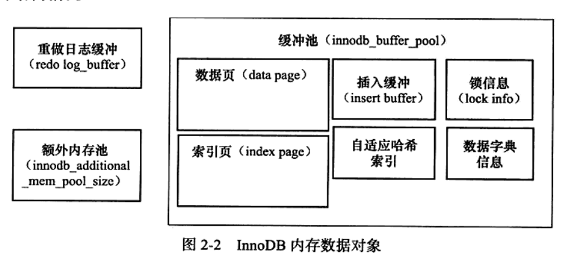
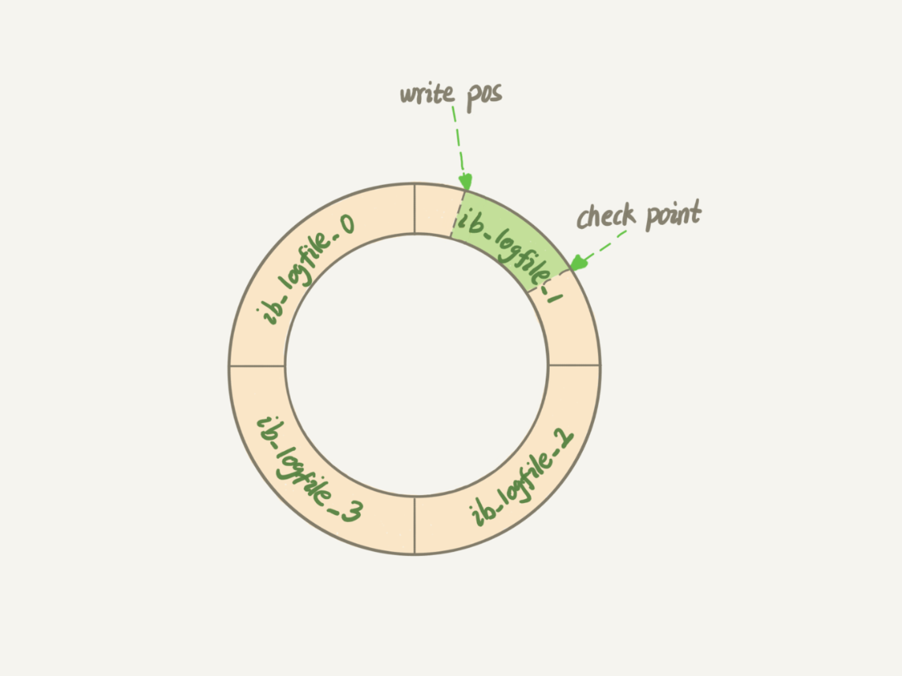

# 2. InnoDB存储引擎

## 整体架构

<figure>
  
  <figcaption>Fig.2-1 - InnoDB存储引擎体系架构。</figcaption>
</figure>

内存池维护了

1）所有进程/线程需要访问的多个内部结构；

2）缓存磁盘上的数据，方便快速读取；对磁盘数据的修改也会现在内存中缓存；

3）重做日志（redo log）缓冲...

后台线程负责

1）刷新内存池中的数据，保证缓冲池中的内存缓冲的是最新的数据；

2）将已经修改的数据文件刷新到磁盘文件，同时保证在数据库发生异常的情况下InnoDB能回复正常。

### 后台线程

InnoDB存储引擎是个多线程模型，线程各司其职

* master thread

  主要负责将缓冲池中的数据异步刷新到磁盘，保证数据的一致性：脏页刷新、合并插入缓冲和UNDO页回收等。

* IO thread

  InnoDB大量使用了AIO（异步IO）来处理写IO请求，IO thread的工作就是负责这些IO请求的回调处理。

  通过`show engine InnoDB status`可以看出来有四种类型的IO thread：

  read、write、log和insert buffer thread。

  read和write线程的数量可以通过参数设计，

* purge  thread

  事务被提交后，其所使用的undo log可能不再需要，PurgeThread负责回收已经使用并分配的undo 页。

  >  这项任务在1.1之间是交给master thread完成的，1.1之后可以设置单独的purgethread负责。

* Page cleaner thread

  1.2.x版本引入，负责将内存池中脏页的刷新操作。

  目的是减轻master thread 的工作。

### 内存池

<figure>
  
  <figcaption>Fig.2-2 - InnoDB内存数据对象。缓冲池占据了很大的一部分，此外还有重做日志缓冲和额外内存池。</figcaption>
</figure>

数据页：InnoDB中，数据管理的最小单位为页，默认是16KB，页中除了存储用户数据，还可以存储控制信息的数据。

* 缓冲池

  InnoDB存储引擎基于磁盘存储，由于CPU速度与磁盘读取速度的鸿沟，基于磁盘系统的数据库系统需要利用缓冲池来提高性能。

  读取页时会现将页放置在缓冲池中，这个过程称之为**FIX**；下次读取的时候，会先判断缓冲池中是否存在目标页。

  修改页时首先修改缓冲池中的数据页，然后以一定频率刷新（更新）到磁盘，刷新机制称之为CheckPoint。

  数据页和索引页占据了缓冲池很大一部分，此外还有其他数据。

  缓冲池个数是可以配置的，大于1时每页根据哈希值平均分配到不同的缓冲池实例中。

* 重做日志缓冲

  InnoDB首先将重做日志写入到重做日志缓冲，然后按照一定频率将其刷新到重做日志（存放于磁盘）中。

  刷新时机如下：

  1）master thread 每隔一秒刷新；

  2）事务提交时刷新；

  3）重做日志缓冲空间低于一半时刷新；

* 额外内存池

  额外内存池记录例如LRU、锁、等待时间等信息。

### Free/LRU/Flush List

> 这三个概念似乎只是针对数据页。

* Free List

  其上的节点都是未被使用的节点，如果需要从数据库中分配新的**数据页**，直接从上获取即可。

  InnoDB 需要保证 Free List 有足够的节点，提供给用户线程用，否则需要从 FLU List 或者 LRU List 淘汰一定的节点。

  InnoDB 初始化后，Buffer Chunks 中的所有数据页都被加入到Free List，表示所有节点都可用。

* LRU List

  这个是InnoDB中最重要的链表。所有新读取进来的**数据页**都被放在上面。

  链表按照最近最少使用算法排序，最近最少使用的节点被放在链表末尾，如果Free List里面没有节点了，就会从中淘汰末尾的节点。

  LRU List 还包含没有被解压的压缩页，这些压缩页刚从磁盘读取出来，还没来的及被解压。

  LRU List 被分为两部分，默认前5/8为young list，存储经常被使用的热点 page，后3/8为 old list。
  新读入的page默认被加在old list头，只有满足一定条件后，才被移到young list上，主要是为了预读的数据页和全表扫描污染 buffer pool。

  > 某个扫描操作需要读出大量的页，如果采用朴素的LRU算法，这些低频的页将会被置于LRU链表头部；
  >
  > 真正高频的，位于链表头部的页将会被淘汰，下次访问时需要重新从磁盘读入。

* Flush List / FLU list

  这个链表中的所有节点都是脏页，也就是说这些数据页都被修改过，但是还没来得及被刷新到磁盘上。

  在FLU List上的页面一定在LRU List上，但是反之则不成立。

  一个数据页可能会在不同的时刻被修改多次，在数据页上记录了最老(也就是第一次)的一次修改的lsn，即oldest_modification。

  不同数据页有不同的 oldest_modification，FLU List中的节点按照 oldest_modification 排序，链表尾是最小的，也就是最早被修改的数据页，当需要从FLU List中淘汰页面时候，从链表尾部开始淘汰。

  加入 FLU List，需要使用 flush_list_mutex 保护，所以能保证FLU List中节点的顺序。

  > LRU列表用于管理页的可用性，FLU列表用于管理将页刷回磁盘。
  >
  > LRU还包含干净的非脏页的数据页。
  >
  > 当接收到一条写操作时，如果涉及到的数据存在于缓冲池中，则直接修改缓冲池中的数据；
  >
  > 否则，需要将数据页从磁盘加载到缓冲池中，首先需要先向 Free List 申请空白节点，数据页会被挂在 LRU List 上。
  >
  > 当 Free List 节点不足时，需要淘汰 LRU 或者 FLU List 上的节点。
  
  

## Checkpoint 技术

  DML语句如（delete/update）会刷新页中的记录，使之变成脏页。脏页需要找个合适的时机刷新磁盘，这便是 checkpoint 技术。

  WAL（write ahead log）策略：当事务提交时，先写重做日志，再修改页。这样当发生宕机时，就可以通过重做日志回复数据。

* checkpoint 技术要解决的问题：

  1）缩短数据库的恢复时间；

  ​	数据恢复时，checkpoint 之前的数据就不再需要重做，这样便缩短了恢复时间。

  2）缓冲池不够用时，将脏页刷新到磁盘；

  ​	缓冲池不够用时，LRU溢出数据页，如果是脏页则需要强制执行checkpoint ，即刷新磁盘数据。

  3）重做日志不够用时，刷新磁盘。

  ​	重做日志是一个环形结构，当日志不够用时需要强制刷新。

* checkpoint 分类

  1）Sharp Checkpoint 刷新全部脏页

  ​	数据库关闭时，会刷新所有的脏页。

  2）Fuzzy Checkpoint 刷新部分脏页

  * master thread 定时定比例刷新脏页；

  * flush-lru-list 刷新来自LRU的脏页；（page cleaner干的活，保证lru有`InnoDB_lru_scan_depth`个空闲页）

  * async / sync flush checkpoint；为了保证重做日志的可用性，page cleaner的活；

    这里脏页是从脏页列表中选取的（就是flu list?）

  * dirty page too much checkpoint; 控制脏页的比例，小于`InnoDB_max_dirty_pages_pct`75%。

<figure>
  
  <figcaption>Fig.2-3 - RedoLog是环形buffer，绿色部分是可写的，当write pos逼近checkpoint时表示log写满，强制触发刷新。</figcaption>
</figure>

## InnoDB关键特性

### 插入缓冲（insert buffer)

[the InnoDB db change buffer](https://mysqlserverteam.com/the-InnoDB-change-buffer/)

* why 为什么需要插入缓冲？

  为了解决写操作的随机I/O问题。

  当一个记录插入表时，记录需要被放入主键索引（聚簇索引clustered index）和二次索引（secondary index)；

  主键索引一般是自增ID，插入是有顺序的，不需要磁盘的随机读写。二次索引页的叶子节点的插入并不是顺序的，需要离散的访问索引页。

  为了解决二次索引随机 IO 问题，InnoDB 存储引擎引入了 insert buffer。

  insert buffer一开始只支持 insert 操作，后面同样支持update、delete（DML）操作，因此也被称之为change buffer。

* 只有非唯一的辅助索引才能使用 insert buffer
	
	插入缓冲时，引擎并不会去查找索引页来判断待插入的索引的唯一性，否则就将触发随机的磁盘读写。
	
* how 插入 buffer 如何工作？

  插入时，如果 buffer pool 缓存了这条记录所在的索引页，那么就会直接写入；否则，会将插入操作记录在insert buffer。然后再以一定的策略将 inser buffer 和辅助索引页子节点进行merge。这时通常能够将多个插入操作合并到一个操作中，这就大大提高了非聚集索引的插入性能。
  
* 实现细节

  比较复杂，没看懂。

### 两次写（double write）

* why 为什么需要double write?

  已经有了RedoLog为什么还需要两次写？

  当脏页刷新回磁盘的时候，如果此时数据库突然crash，则磁盘页可能发生损坏。RedoLog记录的是对页的物理操作（如偏移量888写"aaa"），如果磁盘发生损坏，再对其重做是没有意义的。

* how 具体double write是怎么工作的？

  1）首先将脏页的数据拷贝到内存中的doublewrite buffer；

  2）doublewrite buffer再分两次将数据拷贝到磁盘的共享表空间；

  3）最后将内存中的doublewrite buffer**离散的**写入到数据文件；

  <figure>
    
    <figcaption>Fig.2-4 - InnoDB存储引擎double write架构，注意buffer pool是将整个数据页缓冲到内存。</figcaption>
  </figure>

### 自适应哈希索引（adaptive hash index)

B+树的查找次数取决于树的高度，生产环境中通常需要找3-4次；而总所周知，哈希只需要查找一次。

InnoDB存储引擎会监控表上对各索引页的查询。如果观察到建立哈希索引可以带来速度提升，则会自动根据访问的频率和模式**自动**的为某些热点页建立哈希索引。

AHI要求：

1）以该模式访问100次；

2）页通过该模式访问了N次，其中N = 页中的记录 * 1/16；

AHI只能用来搜索等值的查询模式，模式例如：

1）WHERE a = xxx;

2）WHERE a = xxx and b = xx;

### 异步I/O（async I/O）

异步I/O可以提高磁盘的访问性能。

同步I/O进行一次IO操作，需要等到本次操作完成，才能执行下一次操作；

异步I/O发出一次IO请求之后，可以立即发出下一条IO操作，直到全部请求发送完毕，等待所有操作完成。

异步I/O带来的另一个好处是可以进行IO操作的合并merge ，如果读取的页相邻，则可以合并读取。

### 刷新邻接页（Flush Neighbor Page）

当刷新一个脏页时，会检测其所在区（extent）的所有页，如果是脏页，则一起刷新。

好处是可以通过AIO将多个IO操作合并成一个IO操作。这个对于低IOPS的硬盘性能提升明显。

## 启动、关闭和恢复

启动和关闭时，可以执行InnoDB的行为，比如是否进行purge操作等。

