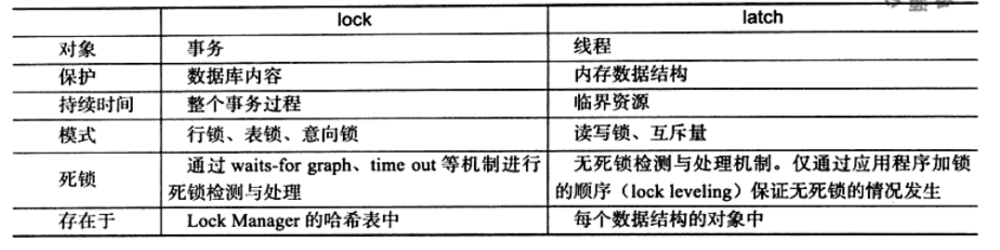
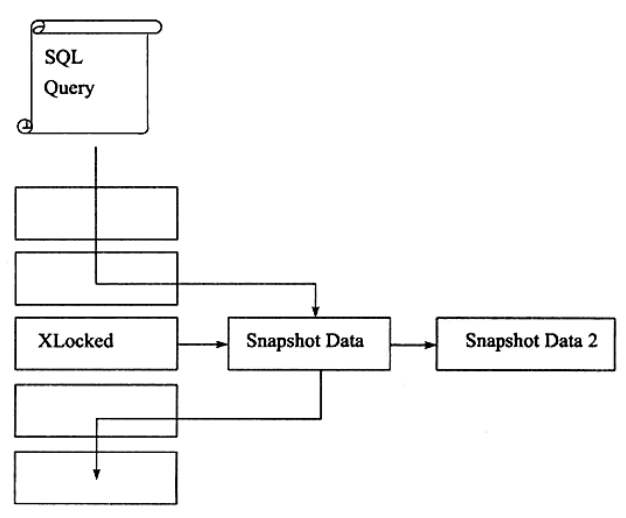

# 6. 锁

数据库的难点在于：一方面要最大程度地利用数据库的并发访问，另外一方面还要确保用户能以一致的方式读取和修改数据。

数据库用锁机制管理共享资源的并发访问。

数据库中的锁有两种，称之为lock和latch。
在InnoDB引擎中，latch可以分为互斥量mutex和读写锁rwlock。目的是保证并发线程对临界资源访问的正确性。
而lock的对象是事务，用来锁定数据库中的表、页和行，通常有死锁检测机制。、

<figure>
  
  <figcaption>Fig.6-1 lock和latch的比较。</figcaption>
</figure>

## InnoDB引擎中的锁

### 锁的类型

InnoDB实现了两种标准的**行级锁**：

* 共享锁（Shared lock）：允许事务读一行数据；

* 排他锁（eXclude lock）：允许事务删除或者更新一行数据；

兼容性：事务A对一行记录加了排他锁，则其他事务不能施加共享锁或者排他锁；事务A对一行记录施加共享锁，可以接收其他事务对同一行记录施加共享锁。

InnoDB支持**表级别**的锁：

```mysql
# mysql支持表锁
LOCK TABLE my_tabl_name READ; # 用读锁锁表，会阻塞其他事务修改表数据。
LOCK TABLE my_table_name WRITe; # 用写锁锁表，会阻塞其他事务读和写。
```

此外还支持两种意向锁：

* 意向共享锁（Intention Shared lock）：事务想要获得表中某几行的共享锁；

  > 事务对表中某一行施加行锁时，数据库会**自动**申请该行所在表的意向锁。当一个事务试图对**整个表**进行加共享锁之前，首先需要获得这个表的意向共享锁。

* 意向排他锁（Intention eXclude lock）：事务想要获得表中华某几行的排它锁；

  > 当一个事务试图对**整个表**进行加排它锁之前，首先需要获得这个表的意向排它锁。

表级意向锁、表锁和行锁的关系：

> 假设事务A对表中某行施加了行锁，并且尚未提交事务，这是表被自动施加了意向锁。
>
> 事务B申请**整个表**的写锁，会做尝试：1）是否存在其他的表（写/读）锁；2）表中的每一行是否被行锁锁定；
>
> 如果不存在意向锁，2）的校验必须扫整个表。因为发现表上有事务A的意向锁，事务B写锁会被阻塞。
>
> 意向共享锁和表共享锁兼容，其余都是互斥的

意向锁和行级锁兼容性：

IX，IS是表级锁，不会和行级的X，S锁发生冲突。只会和表级的X，S发生冲突。
两个事务申请行锁，不需要校验意向锁。

可以在INFORMATION_SCHEMA表中的InnoDB_TRX、InnoDB_LOCKS和InnoDB_LOCKSInnoDB_LOCKS_WAITS查看事务和锁的状态。

### 一致性非锁定读consistent nonlocking read

一致性-非锁定-读：指的是存储引擎通过多行版本控制的方式读取当前数据库中的数据。如果此时某行正在被修改（delete or update），读取操作并不会被阻塞，而是去读取该行的快照数据。

<figure>
  
  <figcaption>Fig.6-2 InnoDB存储引擎一致性非锁定读。当某行被锁定时，会直接读取其快照数据。即读取不会占用和等待表上的锁。</figcaption>
</figure>

快照数据指的是改行之前版本的数据，该实现是通过undo实现的（undo用来在事务撤销中快速的回滚数据）。

在隔离级别为**READ COMMITTED**和**REPEATABLE READ** 下，InnoDB存储引擎使用非锁定的一致性读。

但是两种级别使用的快照数据是不一致的：

**READ COMMIT**隔离级别下，总是读取最新的快照数据，这就意味着会有**不可重复读**问题。

**REPEATABLE READ**隔离级别下，总是读取该事务开始时的快照版本。

* 多版本并发控制MVCC multi version concurrency control

  一行记录上有不同版本的数据，由此带来的并发控制，称之为多版本并发控制。

### 一致性锁定读consistent locking read

> RR + 一致性非锁定读可以解决不可重复读问题；
>
> RR + 一致性锁定读可以解决幻读问题；

为了保证数据逻辑的一致性，数据库支持加锁操作，这里应该能解决幻读问题。因为会使用next-key lock。

```mysql
# for update会对读取的行记录加一个X锁，其他事务不能对已锁定的行加任何锁；
# 通过强制加X锁，读取的数据保证不会发生变化。
SELECT ... FOR UPDATE
# 下面的语句会对读取的杭行记录加一个S锁，其他事务可以加S锁，但是X锁会被阻塞；
SELECT ... LOCK IN SHARE MODE

# 注意上使用的时候要保持在一个事务中（用begin/start transsaction开启，或者set autocommit = 0)
# 因为事务自动提交会释放锁
```

### 自增长与锁

> 这一小节讨论的问题是使用自增ID的列，插入时，自增ID的值如何确认？
>
> 一种方式是AUTO-INC Locking，语句时`select max(auto_inc_col) from t for update`, 显然这个语句会有阻塞问题；
>
> InnoDB引擎另外提供了一种轻量级互斥量的自增长实现机制，性能比较高，但是不能保证是完全连续的；此外如果binlog采用的是statement格式，则replication会有问题。

### 外键和锁

> 这一小节探讨的是跨表的锁定问题。

## 锁的算法

行锁有三种算法

* 记录锁record lock; 只对记录本行上锁；

* 间隙锁gap lock; 锁定一个范围，但是不包含记录本行；

  比如现有索引为1，3，6；条件where a = 3，则上锁范围为前后键，（1， 3）与（3， 6）

  用户是可以关闭gap lock的，只要设置隔离级别为RC或者设置InnoDB_locks_unsafe_for_binlog为1。

* next-key lock; 记录所和间隙锁的结合，锁定一个范围&对本行上锁；这里的锁指的是X锁；

行锁是对索引加锁的，next-key lock如果是对主键上锁，则会降级为记录锁。

```mysql
# 表t有主键和辅助索引列a,b；表中数据为（1，1），（3，1），（5，3），（7， 6），（10， 8）
select * from t where b = 3 for update
# 这条语句会对索引a=5上锁，然后对辅助索引施加next-key lock，锁定(1，3]和（3，6)范围。
```

**幻读Phantom problem**

同一事务下，前后执行相同的SQL语句会得到不相同的结果，第二次可能会返回第一次不存在的行。

InnNoDB存储引擎采用 RR + next-key lock 来避免幻读问题。

## 锁带来的问题

锁只会带来三个问题：脏读、不可重复读和更新丢失。

* 脏读

  脏读指的是一个事务读到了另一个事务中尚未commit的数据，这种情况常见于设置隔离级别为**READ UNCOMMITED**的数据库。

* 不可重复读

  在同一个事务中，同一个SQL语句前后读取的结果不一致，比如另一个事务提交了更新事务，这种情况常见于隔离级别为**READ COMMITED**的数据库。

  和脏读不同，不可重复读是读到另一事物已经提交的记录。所以其实还是合理的，有些数据库的默认隔离级别就是RC。

* 更新丢失

  事务的一个操作会被另一个操作覆盖，导致数据不一致。这种通常是因为多用户更新逻辑的问题。

  避免的方式就是使用一致性锁定读。保证操作期间数据不会发生任何变更。

## 锁阻塞问题

> 首先，阻塞是一个合理的现象，当一个事务需要访问加锁记录时，就应该阻塞。
>
> 阻塞的时间可以由参数`InnoDB_lock_wait_timeout`在session级别指定；
>
> `InnoDB_rollback_on_timeut`控制超时行为，默认为off不回滚；注意这个参数运行时不能修改。

## 死锁问题

指的是至少两个的事务在竞争资源的时候互相等待的过程，若没有外力的作用，参与的事务都将无法继续推进。

怎么解决死锁呐？

最简单的办法就是**超时**，当一个事务的等待时间超过阈值时，就放弃重试；这样另一个事务就能继续执行。

另外一中解决机制就是**wait-graph**，InnoDB就是采用了此种策略。这是一种主动的策略 ，如果存在死锁，则会选择回滚undo量最小的事务。

## 锁升级问题

> 锁升级问题讨论的是行锁编程页锁的类似锁范围变大的问题。
>
> 核心因素在于锁在存储引擎实现上是不是一种稀缺资源，比如一个锁需要消耗不少的内存资源。
>
> 锁升级之后，数目变少，内存自然变少，管理成本降低。

InnoDB存储引擎根据页加锁，并且采用了位图方式。因此不管一个事务锁了页中一个记录或者多条记录，其代价是一致的。

因此，InnoDB不存在锁升级的问题。

