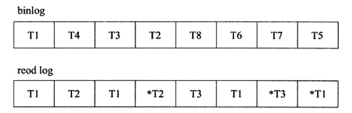

# 7. 事务

> 这个章节首先介绍了事务的ACID特性，然后介绍存储引擎对事务原子性的实现，最后给出事务的正确使用姿势。

## 认识事务

事务可由一条简单的SQL语句组成，也可以由一组复杂的SQL语句组成。

### 事务的ACID特性

理论上来说事务应该严格的满足ACID特性，但是出于各种考虑，数据库厂商并不会严格的实现ACID。比如RC其实并不满足隔离性。

InnoDB中的事务完全符合ACID特性，

* Atomic原子性

  原子性指的是事务中的所有操作都是不可分割的工作单位，所有的操作都必须执行成功；否则应该回撤已经执行成功的所有操作。

  这也意味着数据库必须保护受影响的数据，能够干净利落的回撤。

* Consistent一致性

  数据库总是从一种有效状态转换到另一种有效状态。

  比如有个字段的名字要求不能重复，如果一个事务commit或者回滚的时候，使得数据库出现了相同的名字，这就使得数据库陷入了失效的状态。

* Isolation 隔离性

  隔离性是说事务之间的操作不会互相影响，事务提交前对其他事务都是不可见的。

  理想的隔离状态是串行化。事务排队执行，当前事务执行完成之后才能执行下一个事务。

  第六章通过锁实现了事务之间的隔离性。

* durability持久性

  事务一旦提交其结果就是永久性的。即使发生宕机，数据库也能将数据恢复。

### 事务的分类

* 扁平事务Flat transaction

  日常使用最为频繁的事务。

  所有的操作都处于同一层次，由`BEGIN WORK`开始，以`COMMIT WORK`或者`ROLLBACK WORK`结束。

* 带有保存点扁平事务Flat Transaction wtth Savepoints

  扁平事务失败，就得回滚所有操作；带有保存点的事务，回滚时可以指定回滚某个具体的保存点。

  扁平事务默认的保存点其实是事务开始，也就是没有发生操作的状态。

  保存点是在提醒数据库记录事务当前时刻的状态。

* 链事务Chained Transaction

  保存点模型的变种。

* 嵌套事务Nested Transaction

  顶层事务控制着各个层次的事务。

* 分布式事务Distributed Transaction

  一个事务涉及到多个数据库，并且数据库之间可能时通过网络连接的。比较复杂。

## 事务的实现

事务的隔离性是由第六章提到的锁实现的；

redo log重做日志保证事务的原子性和持久性；

undo log保证事物的一致性；

> redo 和undo log都可以视为恢复操作，但是两者的记录内容不同。
>
> redo记录的是事务修改页page的物理操作，恢复时是整个页；
>
> undo记录的是行row的逻辑操作，可以回滚行记录到特定版本。

### redo

重做日志分为两部分：重做日志缓冲redo log buffer和 重做日志文件redo log file。

1. **InnoDB引擎何时将日志从缓冲刷新固化到磁盘？**

* 事务提交时

  InnoDB为了保证事务的持久性，使用Force log at commit机制：即当事务提交COMMIT时，必须先将该事务的所有日志刷新到重做日志文件，也就是说必须确保事务日志完全写到硬盘上（系统调用fsync阻塞直到数据别写入到磁盘），一个事务才算是提交成功。

  数据库允许用户在持久性和性能之间做一个平衡，参数`InnoDB_flush_log_at_trx_commit`控制事务提交时重做日志刷新到磁盘上的策略：

  0 - 表示事务提交时不进行写入磁盘操作，等待master thread每隔1s的fsync操作；

  2 - 事务提交时会将日志写入到系统缓存，但是不调用fsync操作，数据库宕机数据不会丢失，但系统宕机就会有问题；

  1 - 事务提交时会将日志写入到系统缓存，并且调用fsync操作；

* log buffer有一半的内存空间已经被使用；

* log  checkpoint时

2. 重做日志和二进制日志的区别

   binlog是用来进行PIT（point in time）的恢复以及主从复制环境的建立。二者的区别在于：

* 生产者不一致

  重做日志是InnoDB特有的日志，是在存储引擎层面产生的；而binlog是在MySQL的server层产生的，每个存储引擎对数据的修改都会生成binlog。

* 内容形式不同

  binlog记录的是逻辑的SQL语句，重做日志记录的是对页的修改，是物理格式（比如偏移量0x80，写入'aaa'）。

* 写入磁盘的时间点不同

  二进制日志只在事务提交完成后进行一次写入，而重做日志在事务进行过程中不断被写入，每个事务可能对应多个日志。

  <figure>
    
    <figcaption>Fig.7-1 binlog和重做日志写入时间点不同，事务完成后写一次binlog，而事务进行过程中会不断的写重做日志。</figcaption>
  </figure>

3. 恢复

   重做日志记录了LSN（log sequence number），重做日志的总量。另外在磁盘页中页记录了该页最后刷新时的LSN大小。

   注意，重做日志记录的是每个页的日志！因此重做日志和页中的LSN就可以用来指导页的恢复工作。

   两个有趣的点：

   1）无论数据库上次运行是否正常关闭，重启时都会进行重做日志的恢复，通过LSN确定恢复的范围；

   2）重做日志记录的是物理日志，恢复速度比二进制日志快得多。

   <figure>
     
     <figcaption>Fig.7-2 假设数据库在LSN=1000的时候宕机了，重启时恢复的范围是10000~13000。</figcaption>
   </figure>

### undo

undo log用来支持回滚和MVCC特性。

undolog 记录的是逻辑日志。

undo存放在共享表空间中的undo segment，undo segment会分配页，用于写入undo log。

事务提交后（就是不需要考虑回滚的事情了）并不能立即删除undo log以及undo log所在的页，因为其他事务可能在进行一致性非锁定读，还需要通过undo log得到行记录之前的版本。

事务提交时会将undo log放入一个链表中，删除工作交由purge线程来判断。

undo log也是需要持久性的保护，因此也会产生redo log。

1. 回滚

   回滚只是说将该事务的影响消除，而不是恢复到事务刚开始时候的阶段（比如一个页可能被其他事务修改了）。

   回滚是SQL语句的逆操作，你执行insert，存储引擎就执行delete；delete就insert；update就执行相反的更新，把行写回去。

2. undo log格式

* insert undo log

  对应的是insert操作；根据事务隔离性的精神，插入操作不应该让其他事务见到，因此事务完成后就可以删除unod log。

* update undo log

  对应的是delete和update 操作，需要考虑MVCC，因此事务完成后不能直接删除，放入链表交由purge thread处理。

  什么时候删？该行记录不再被任何事务所需要。

### purge

> delete和update执行细节也是很有趣的，
>
> delete记录的主键会被标记为删除，delete flag设置为1。
>
> update如果修改主键的话，会先将原先的主键标记为删除，然后插入一条新的记录。

purge最终完成之前的delete和update操作，清理之前行记录的版本。

### group commit

事务重做日志写入的过程如下：

1）修改内存中数据的信息，并且将日志写入到重做日志缓冲buffer；

2）调用fsync，确保重做日志被刷新到磁盘重做日志文件；

fsync是比较耗时的，在等待2）时其他事务可以进行1），然后下一批一起fsync，这样就可以一次fsync，完成多个事务的日志固化。

group  commit减少了磁盘IO操作，大大提升了数据库性能。

**两阶段提交**：

把binlog考虑进来

1）事务修改内存中事务，过程中写了redolog buffer;

2）处于prepare阶段，server层fsync写入binlog日志，由参数sync_binlog控制；

3）将重做日志写入到磁盘；

4）真正commit。

两阶段提交强调binlog的写入必须在redolog file之前，否则恢复时会有问题。

group commit 会打乱2）和3）的顺序，因此开启binlog需要关闭group commit。

**Bin Log Group Commit** BLGC 解决了这个问题。

核心大概是binlog先写入内存，然后调动fsync批量写入到binlog；然后group  commit。

## 事务控制语句

```mysql
# 开启事务
START TRANSACTION; # or
BEGIN;

# 提交事务
COMMIT； # or
COMMIT WORK;

# 回滚
ROLLBACK；

# 设置保存点
SAVEPOINT id;

# 删除保存点
RELEASE SAVEPOINT id;

# 指定回滚点
ROLLBACK TO SAVEPOINT id;

# 设置事务的隔离级别
SET TRANSACTION READ UNCOMMITTED;
SET TRANSACTION READ COMMITTED;
SET TRANSACTION REPEATABLE READ;
SET TRANSACTION SERIALIZABLE;
```

## 事务的隔离级别

| 隔离级别                             | 含义                                                         | 可能导致                                                 |
| ------------------------------------ | ------------------------------------------------------------ | -------------------------------------------------------- |
| ISOLATION_DEFAULT                    | 使用后端数据库默认的隔离级别                                 | MySQL默认使用REPEATABLE_READ，Oracle默认READ_COMMITTED； |
| ISOLATAION_READ_UNCOMMITTED 未提交读 | 允许读取尚未提交的数据变更                                   | 脏读、不可重复读、幻读                                   |
| ISOLATION_READ_COMMITTED 已提交读    | 允许读取并发事务已经提交的数据                               | 不可重复读、幻读                                         |
| ISOLATION_REPEATABLE_READ 可重复读   | 对同一字段的多次读取结果是一致的，除非数据是被本事务自己所修改 | 幻读                                                     |
| ISOLATION_SERIALIZABLE 可串行化      | 完成服从 ACID 隔离级别，确保阻止脏读、不可重复读、幻读。这是最慢的事务隔离级别，因为它通常是通过完全锁定事务相关的数据库来实现的 | 无                                                       |

几个有趣的事情

1）不可重复读和幻读
	前者指同一条记录前后结果不一致，后者值前后读出的记录数量不一致。

​	但是，幻读有时也包括了前者的情况，建议不要强行区分。

2）REPEATABLE READ

​	可重复读并不能解决幻读的问题，但是 RR + next key locking 就能搞定幻读问题；即达到了SQL标准的SERIALIZABLE；

3）SERIALIZABLE

​	这个隔离级别会为每个select 语句添加`LOCK IN SHARE MODE`，也就是加了共享锁。

​	因为RR+ next key locking 就能实现SERIALIZABLE的隔离级别，所以本地事务不推荐使用SERIALIZABLE。

​	SERIALIZABLE主要用于InnoDB存储引擎的分布式事务。

4）隔离级别越低，性能越高？

​	结论是不明显。RR不一定比SERIALIZABLE高，同样RC不一定比RR高；

5）RC

​	RC一般不使用gap lock。

​	RC不能和 format 为 statement 的 binlog 一起使用，否则会造成replication问题。

