# 1. MySQL体系结构和存储引擎

## 整体架构

<figure>
  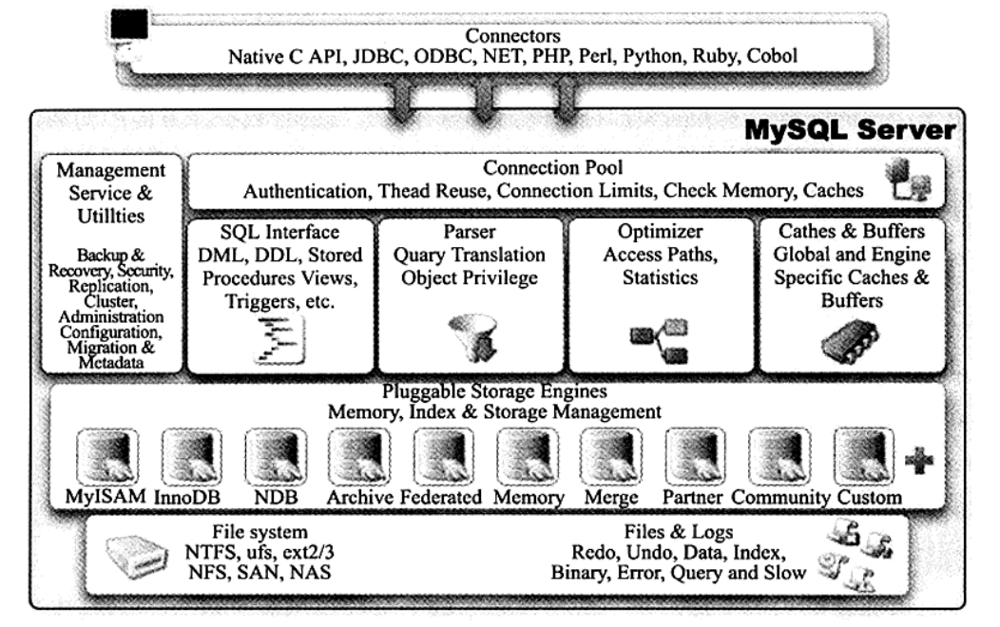
  <figcaption>Fig.1-1 - MySQL基本架构示意图。</figcaption>
</figure>

一次[query过程](https://juejin.cn/post/6844903869474930696)：

<figure>
  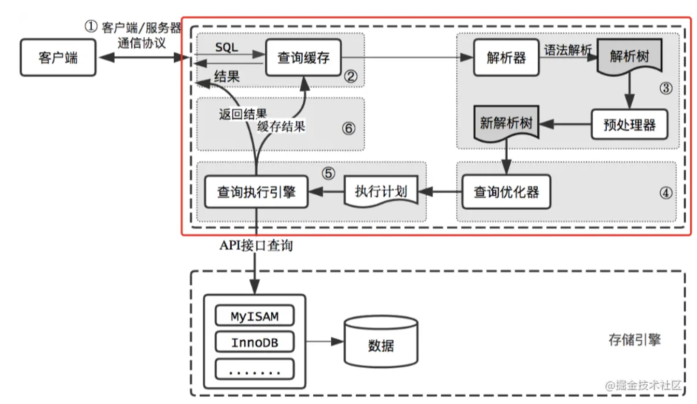
  <figcaption>Fig.1-2 - 查询流程示意图。</figcaption>
</figure>

MySQL由以下几部分组成：

* 连接池组件

  连接、鉴权（check 用户名密码）和权限验证都是在连接器里做的；

  连接有长、短连接之分。建立连接的过程比较复杂，建议使用长连接。

  长连接内存涨的很快：1）定期断开长连接（MySQL释放掉资源）；2）执行`mysql_reset_connection`当前版本 >= 5.7；

* 管理服务和工具组件

* SQL接口组件

* 查询分析器组件

* 优化器组件

* 缓冲（cache）组件

* 插件式存储引擎

  **插件式的表存储引擎**是MySQL区别于其他数据库的一个重要特点。

  存储引擎是基于表的，而不是数据库的。一个数据库下每个表可以有自己的存储引擎。

* 物理文件

## 存储引擎

`show engines\G`可以显示数据库支持的存储引擎。

<figure>
  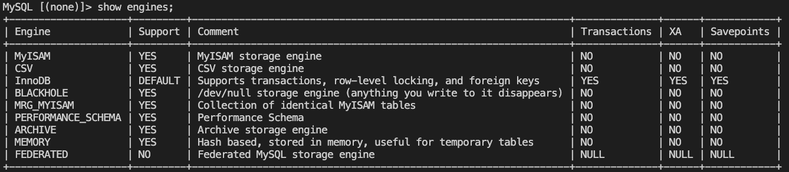
  <figcaption>Fig.1-3 - show engines显示的结果。注意到只有InnoDB支持事务。</figcaption>
</figure>

### InnoDB存储引擎

设计目标是线上事务处理**OLTP**（online transaction processing），支持事务。

特点是：行锁设计、支持外键、非锁定读（默认读取操作会产生锁）。

MySQL采用多版本控制MVCC实现高并发性，并且实现了SQL标准的四种隔离标准，默认为**REPEATABLE**级别。同时使用了一种next-key locking 的策略来避免**幻读（phantom）**的产生。

InnoDB还支持：插入缓冲（insert buffer）、二次写（double writer）、自适应哈希索引（adaptive hash index）和预读（read ahead）等高性能和高可用的功能。

### MyISAM存储引擎

设计目标是线上分析处理OLAP（online analysis processing），不支持事务。

表锁设计，支持全文检索。

MyISAM的缓冲池只缓冲索引文件，不缓存数据文件。

### Memory存储引擎

该引擎将表中的数据存放在内存中（一旦重启或者崩溃，表中的数据都将消失）。

适合于存储临时数据。

Memory引擎默认使用哈希索引，而不是B+树。

只支持表锁，并发性能查。

# 2. InnoDB存储引擎

## 整体架构

<figure>
  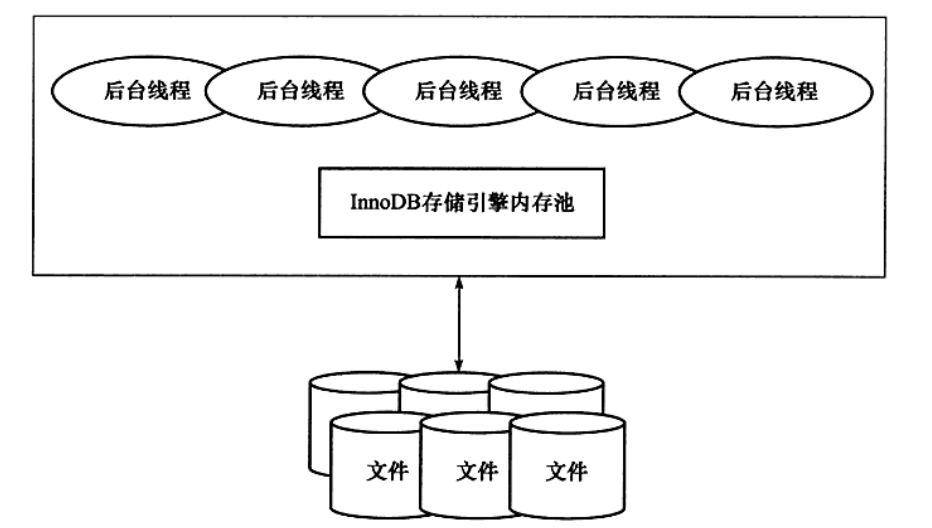
  <figcaption>Fig.2-1 - InnoDB存储引擎体系架构。</figcaption>
</figure>

内存池维护了

1）所有进程/线程需要访问的多个内部结构；

2）缓存磁盘上的数据，方便快速读取；对磁盘数据的修改也会现在内存中缓存；

3）重做日志（redo log）缓冲...

后台线程负责

1）刷新内存池中的数据，保证缓冲池中的内存缓冲的是最新的数据；

2）将已经修改的数据文件刷新到磁盘文件，同时保证在数据库发生异常的情况下InnoDB能回复正常。

### 后台线程

InnoDB存储引擎是个多线程模型，线程各司其职

* master thread

  主要负责将缓冲池中的数据异步刷新到磁盘，保证数据的一致性：脏页刷新、合并插入缓冲和UNDO页回收等。

* IO thread

  InnoDB大量使用了AIO（异步IO）来处理写IO请求，IO thread的工作就是负责这些IO请求的回调处理。

  通过`show engine InnoDB status`可以看出来有四种类型的IO thread：

  read、write、log和insert buffer thread。

  read和write线程的数量可以通过参数设计，

* purge  thread

  事务被提交后，其所使用的undo log可能不再需要，PurgeThread负责回收已经使用并分配的undo 页。

  >  这项任务在1.1之间是交给master thread完成的，1.1之后可以设置单独的purgethread负责。

* Page cleaner thread

  1.2.x版本引入，负责将内存池中脏页的刷新操作。

  目的是减轻master thread 的工作。

### 内存池

<figure>
  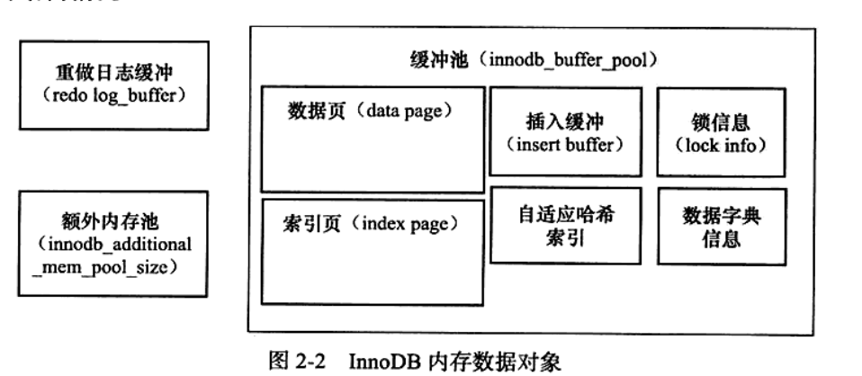
  <figcaption>Fig.2-2 - InnoDB内存数据对象。缓冲池占据了很大的一部分，此外还有重做日志缓冲和额外内存池。</figcaption>
</figure>

数据页：InnoDB中，数据管理的最小单位为页，默认是16KB，页中除了存储用户数据，还可以存储控制信息的数据。

* 缓冲池

  InnoDB存储引擎基于磁盘存储，由于CPU速度与磁盘读取速度的鸿沟，基于磁盘系统的数据库系统需要利用缓冲池来提高性能。

  读取页时会现将页放置在缓冲池中，这个过程称之为**FIX**；下次读取的时候，会先判断缓冲池中是否存在目标页。

  修改页时首先修改缓冲池中的数据页，然后以一定频率刷新（更新）到磁盘，刷新机制称之为CheckPoint。

  数据页和索引页占据了缓冲池很大一部分，此外还有其他数据。

  缓冲池个数是可以配置的，大于1时每页根据哈希值平均分配到不同的缓冲池实例中。

* 重做日志缓冲

  InnoDB首先将重做日志写入到重做日志缓冲，然后按照一定频率将其刷新到重做日志（存放于磁盘）中。

  刷新时机如下：

  1）master thread 每隔一秒刷新；

  2）事务提交时刷新；

  3）重做日志缓冲空间低于一半时刷新；

* 额外内存池

  额外内存池记录例如LRU、锁、等待时间等信息。

### Free/LRU/Flush List

> 这三个概念似乎只是针对数据页。

* Free List

  其上的节点都是未被使用的节点，如果需要从数据库中分配新的**数据页**，直接从上获取即可。

  InnoDB需要保证Free List有足够的节点，提供给用户线程用，否则需要从FLU List或者LRU List淘汰一定的节点。

  InnoDB初始化后，Buffer Chunks中的所有数据页都被加入到Free List，表示所有节点都可用。

* LRU List

  这个是InnoDB中最重要的链表。所有新读取进来的**数据页**都被放在上面。

  链表按照最近最少使用算法排序，最近最少使用的节点被放在链表末尾，如果Free List里面没有节点了，就会从中淘汰末尾的节点。

  LRU List还包含没有被解压的压缩页，这些压缩页刚从磁盘读取出来，还没来的及被解压。

  LRU List被分为两部分，默认前5/8为young list，存储经常被使用的热点page，后3/8为old list。
  新读入的page默认被加在old list头，只有满足一定条件后，才被移到young list上，主要是为了预读的数据页和全表扫描污染buffer pool。

  > 某个扫描操作需要读出大量的页，如果采用朴素的LRU算法，这些低频的页将会被置于LRU链表头部；
  >
  > 真正高频的，位于链表头部的页将会被淘汰，下次访问时需要重新从磁盘读入。

* Flush List / FLU list

  这个链表中的所有节点都是脏页，也就是说这些数据页都被修改过，但是还没来得及被刷新到磁盘上。

  在FLU List上的页面一定在LRU List上，但是反之则不成立。

  一个数据页可能会在不同的时刻被修改多次，在数据页上记录了最老(也就是第一次)的一次修改的lsn，即oldest_modification。

  不同数据页有不同的oldest_modification，FLU List中的节点按照oldest_modification排序，链表尾是最小的，也就是最早被修改的数据页，当需要从FLU List中淘汰页面时候，从链表尾部开始淘汰。

  加入FLU List，需要使用flush_list_mutex保护，所以能保证FLU List中节点的顺序。

  > LRU列表用于管理页的可用性，FLU列表用于管理将页刷回磁盘。
  >
  > LRU还包含干净的非脏页的数据页。

## Checkpoint技术

  DML语句如（delete/update）会刷新页中的记录，使之变成脏页。脏页需要找个合适的时机刷新磁盘，这边是checkpoint技术。

  WAL（write ahead log）策略：当事务提交时，先写重做日志，再修改页。这样当发生宕机时，就可以通过重做日志回复数据。

* checkpoint技术要解决的问题：

  1）缩短数据库的恢复时间；

  ​	数据恢复时，checkpoint之前的数据就不再需要重做，这样便缩短了恢复时间。

  2）缓冲池不够用时，将脏页刷新到磁盘；

  ​	缓冲池不够用时，LRU溢出数据页，如果是脏页则需要强制执行checkpoint ，即刷新磁盘数据。

  3）重做日志不够用时，刷新磁盘。

  ​	重做日志是一个环形结构，当日志不够用时需要强制刷新。


* checkpoint 分类

  1）Sharp Checkpoint 刷新全部脏页

  ​	数据库关闭时，会刷新所有的脏页。

  2）Fuzzy Checkpoint 刷新部分脏页

  * master thread 定时定比例刷新脏页；

  * flush-lru-list 刷新来自LRU的脏页；（page cleaner干的活，保证lru有`InnoDB_lru_scan_depth`个空闲页）

  * async / sync flush checkpoint；为了保证重做日志的可用性，page cleaner的活；

    这里脏页是从脏页列表中选取的（就是flu list?）

  * dirty page too much checkpoint;控制脏页的比例，小于`InnoDB_max_dirty_pages_pct`75%。

<figure>
  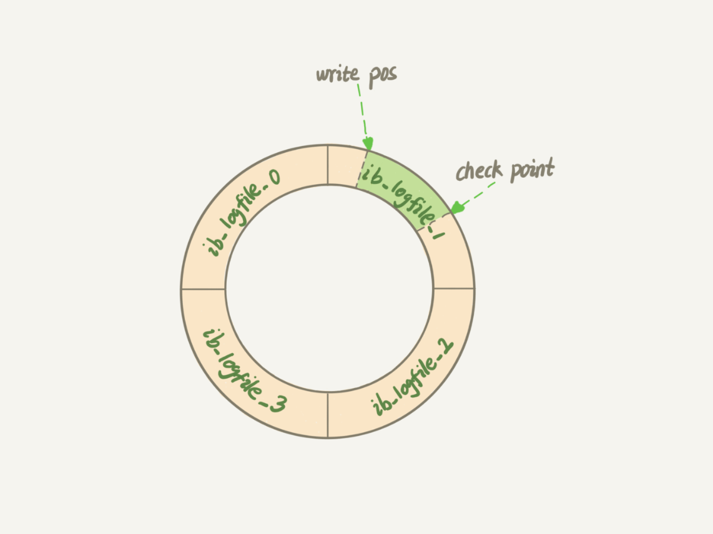
  <figcaption>Fig.2-3 - RedoLog是环形buffer，绿色部分是可写的，当write pos逼近checkpoint时表示log写满，强制触发刷新。</figcaption>
</figure>

## InnoDB关键特性

### 插入缓冲（insert buffer)

[the InnoDB db change buffer](https://mysqlserverteam.com/the-InnoDB-change-buffer/)

* why为什么需要插入缓冲？

  为了解决写操作的随机I/O问题。

  当一个记录插入表时，记录需要被放入主键索引（聚簇索引clustered index）和二次索引（secondary index)；

  主键索引一般是自增ID，插入是有顺序的，不需要磁盘的随机读写。二次索引页的叶子节点的插入并不是顺序的，需要离散的访问索引页。

  为了解决二次索引随机IO问题，InnoDB存储引擎引入了insert buffer。

  insert buffer一开始只支持insert 操作，后面同样支持update、delete（DML）操作，因此也被称之为change buffer。

* 只有非唯一的辅助索引才能使用insert buffer
	
	插入缓冲时，引擎并不会去查找索引页来判断待插入的索引的唯一性，否则就将触发随机的磁盘读写。
	
* how 插入buffer如何工作？

  插入时，如果buffer pool缓存了这条记录所在的索引页，那么就会直接写入；否则，会将插入操作记录在insert buffer。然后再以一定的策略将inser buffer和和辅助索引页子节点进行merge。这时通常能够将多个插入操作合并到一个操作中，这就大大提高了非聚集索引的插入性能。
  
* 实现结束细节

  比较复杂，没看懂。

### 两次写（double write）

* why 为什么需要double write?

  已经有了RedoLog为什么还需要两次写？

  当脏页刷新回磁盘的时候，如果此时数据库突然crash，则磁盘页可能发生损坏。RedoLog记录的是对页的物理操作（如偏移量888写"aaa"），如果磁盘发生损坏，再对其重做是没有意义的。

* how 具体double write是怎么工作的？

  1）首先将脏页的数据拷贝到内存中的doublewrite buffer；

  2）doublewrite buffer再分两次将数据拷贝到磁盘的共享表空间；

  3）最后将内存中的doublewrite buffer**离散的**写入到数据文件；

  <figure>
    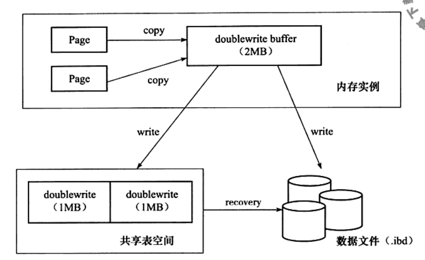
    <figcaption>Fig.2-4 - InnoDB存储引擎double write架构，注意buffer pool是将整个数据页缓冲到内存。</figcaption>
  </figure>

### 自适应哈希索引（adaptive hash index)

B+树的查找次数取决于树的高度，生产环境中通常需要找3-4次；而总所周知，哈希只需要查找一次。

InnoDB存储引擎会监控表上对各索引页的查询。如果观察到建立哈希索引可以带来速度提升，则会自动根据访问的频率和模式**自动**的为某些热点页建立哈希索引。

AHI要求：

1）以该模式访问100次；

2）页通过该模式访问了N次，其中N = 页中的记录 * 1/16；

AHI只能用来搜索等值的查询模式，模式例如：

1）WHERE a = xxx;

2）WHERE a = xxx and b = xx;

### 异步I/O（async I/O）

异步I/O可以提高磁盘的访问性能。

同步I/O进行一次IO操作，需要等到本次操作完成，才能执行下一次操作；

异步I/O发出一次IO请求之后，可以立即发出下一条IO操作，直到全部请求发送完毕，等待所有操作完成。

异步I/O带来的另一个好处是可以进行IO操作的合并merge ，如果读取的页相邻，则可以合并读取。

### 刷新邻接页（Flush Neighbor Page）

当刷新一个脏页时，会检测其所在区（extent）的所有页，如果是脏页，则一起刷新。

好处是可以通过AIO将多个IO操作合并成一个IO操作。这个对于低IOPS的硬盘性能提升明显。

## 启动、关闭和恢复

启动和关闭时，可以执行InnoDB的行为，比如是否进行purge操作等。

# 3. 文件

## MySQL参数文件

告诉MySQL实例启动时在哪里可以找到数据库文件，并且指定某些初始化参数。

## MySQL日志文件

用来记录MySQL实例对某种条件做出响应时写入的文件。

### 错误日志

记录MySQL的启动、运行和关闭过程进行了记录。

```mysql
show variables like 'log_error';
```

### 慢查询日志

可以设置一个阈值`long_query_time`，当一条SQL语句执行时间超过$>$阈值时，这条语句将会被记录到慢查询日志。

甚至可以记录没有使用索引的SQL语句。

### 查询日志

查询日志记录了所有对MySQL数据库的所有请求的信息，无论这些请求是否得到了正确的执行。

### 二进制日志binlog

binlog记录了所有对MySQL数据库执行变更的所有操作，但是不包括SELECT和SHOW这类操作。

**二进制文件主要有以下几个作用**：

1）恢复Recovery

​	某些数据的回复需要binlog。用户可以使用binlog进行point-in-time的恢复。

2）复制Replication

​	通过复制和执行二进制文件，slave MySQL可以同步master MySQL。

3）审计audit

​	可以查看关键SQL语句。

**binlog记录的格式**：

1）STATEMENT

​	二进制文件记录的是逻辑SQL语句。这会带来主从同步的问题，比如SQL语句使用了rand,uuid函数。

2）ROW

​	在该格式下，binlog记录的是表的行更改情况。显然，binlog文件会更大，复制的网络开销也会增大。

3）MIXED

​	混合模式默认采用STATEMEMT格式，但是在某些情况下会使用ROW格式，比如采用了某些不确定函数。

**如何查看binlog**:

```bash
mysqlbinlog --start-position=203 test.000004
```


## InnoDB存储引擎文件

InnoDB存储引擎自己独有的日志文件：表空间文件和重做日志文件。

### 表空间文件tablespace file

可以指定多个路径，使得一个表被分配到不同磁盘上，提高读写效率。

### 重做日志文件redo log file

重做日志文件是InnoDB引擎的事务日志

当实例失败，比如主机断电时，重启时InnoDB存储引擎会利用重做文件恢复到掉电时的时刻，以此来保证数据的完整性。

* **重做日志文件组**

  至少2个大小相同的重做日志文件构成一个文件组；InnoDB循环写入该文件组中的重做日志文件。

* **重做日志文件大小考量**

  重做日志文件不能过大。如果设置的很大，在恢复时需要耗费较长的时间。

  但是也不能设置的过小，否则可能导致一个事务日志可能会多次切换重做日志文件，此外还会可能导致async checkpoint（这是因为容量超过重做日志文件的阈值，导致强制刷新脏页）。

* 同样是记录事务日志，重做日志与二进制日志的区别？

  1）二进制文件是属于MySQL数据库有关的日志；而重做日志是InnoDB独有的日志文件，只会记录InnoDB存储引擎的事务日志；

  2）记录内容不同。二进制文件记录的是关于一个操作的具体内容，即该日志是逻辑日志；而重做日志记录的是每个页page更改的物理情况。

  3）写入时机不同。二进制文件仅在事务提交前进行提交，即只写磁盘一次；而在事务进行过程中，不断有重做日志条目redo entry被写入到重做日志文件中。

* 重做日志写入过程

  重做日志条目结构：

  redo_log_type | space | page_no | redo_log_nody

  引擎先写到redo log buffer，然后按照一定顺序写入到磁盘重做日志文件。

  从buffer到磁盘的时机：

  1）master thread每秒都会将buffer内容写入到磁盘重做日志文件；

  2）事务commit时。行为由`InnoDB_flush_log_at_trx_commit`控制：
  	0 ： 等待主线程写入；1  ： commit时立即写入磁盘；2 ： 异步写到磁盘。

  ​	为了保证持久性，应该设置为1。

  <figure>
    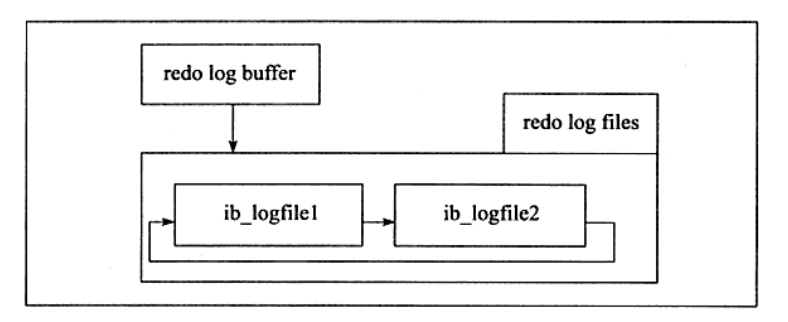
    <figcaption>Fig.3-1 重做日志文件写入过程。</figcaption>
  </figure>

# 4. 表
# 5. 索引与算法

## B+树索引

B+树是为磁盘设计的一种平衡查找树。所有的记录节点都是按照键值的大小顺序放在同一层的叶子节点上，由各叶子节点直接进行连接。

<figure>
  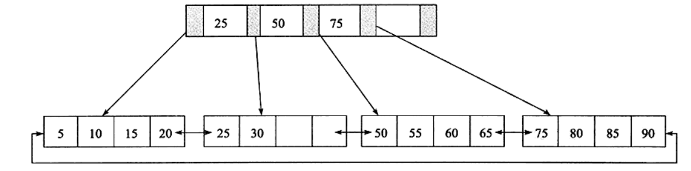
  <figcaption>Fig.5-1 2层的B+树。</figcaption>
</figure>


B+树在数据库中具有高扇出性，高度一般在2-4层。

数据库中的索引可以分为聚集索引和辅助索引，二者内部数据结构都是高度平衡的B+树。叶子节点存放着所有的数据。

### 聚集索引clustered index

聚集索引的B+树的叶子节点存放的是键值以及指向**数据页的偏移量**。

而数据页上存放的是完整的、每行的记录。

<figure>
  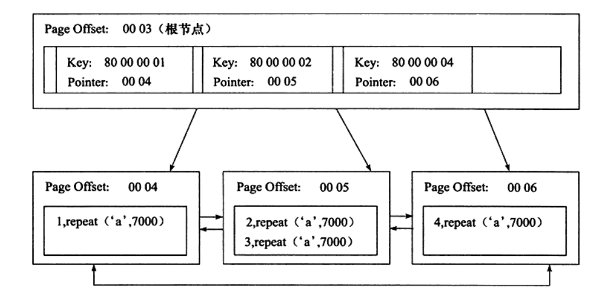
  <figcaption>Fig.5-2 B+树索引。</figcaption>
</figure>

### 辅助索引secondary index

辅助索引的叶子节点除了包含键值以外，还包含了指向相应行数据的聚集索引键。

当通过辅助索引查询数据的时候，引擎首先根据辅助索引叶子节点的数据获得指向主键索引的主键，然后再通过主键索引获取对应的行记录。

> 这里获取到主键是指获取到主键的值，而非主键的指针。
>
> 因此可能的一个查询过程：辅助索引三次查找获得主键值，主键索引再三次查找获取行记录。

## Cardinality

> 如何评估一个索引建的好不好？
>
> 比如按照性别建立索引，那么男女的表中记录可能各占50%，这种索引就没有意义；
>
> 可见，索引应该和其下的记录数量有关，最好就是一个键值对应一条数据，这被称之为可选择性。

如何查看索引是否具有高选择性？

show index的结果中会给出cardinality的数值，表示不重复的记录的数量的预估值。

cardinality / n_rows_in_table的值应该尽量接近于1。（比如主键这个比值应该非常接近于1）

## B+树索引的使用

### 联合索引joint index

多个列构成一个索引，如果idx_a_b。B+树首先根据列a的值进行排序，a值相同的情况下，再按照b值进行排列。

idx_a_b对于

`select * from t where a = xxx and b = xx`这种查询语句特别高效，或者

`select * from t where a = xxx order by b desc`a值固定，查询语句需要根据b排序。

但是并不能加快b的查询。

```mysql
# idx_a_b就是联合索引。
create table t (
  a int,
  b int,
  primary key (a),
  key idx_a_b (a,b)
) ENGINE = InnoDB
```

### 覆盖索引covering index

这种指的是从辅助索引中就可以得到查询的值。

辅助索引的叶子节点包含了主键索引的信息，比如（primary key1, primary key2, key3, key4...)

也就是说查询的值被叶子节点cover了，这样就不需要再通过主键索引访问行记录。

### 优化器不使用索引

查询语句的查询条件和某个辅助索引有关，但是最终却选择了全表扫描。

这是因为没有命中覆盖索引，辅助索引需要通过主键键值访问数据，代价过高。

```mysql
# 如果order_id范围内的数据占全表的20%以上，则可能进行全表扫描。
select * from t where order_id > 100 and order_id < 1000;
```

# 6. 锁

数据库的难点在于：一方面要最大程度地利用数据库的并发访问，另外一方面还要确保用户能以一致的方式读取和修改数据。

数据库用锁机制管理共享资源的并发访问。

数据库中的锁有两种，称之为lock和latch。
在InnoDB引擎中，latch可以分为互斥量mutex和读写锁rwlock。目的是保证并发线程对临界资源访问的正确性。
而lock的对象是事务，用来锁定数据库中的表、页和行，通常有死锁检测机制。、

<figure>
  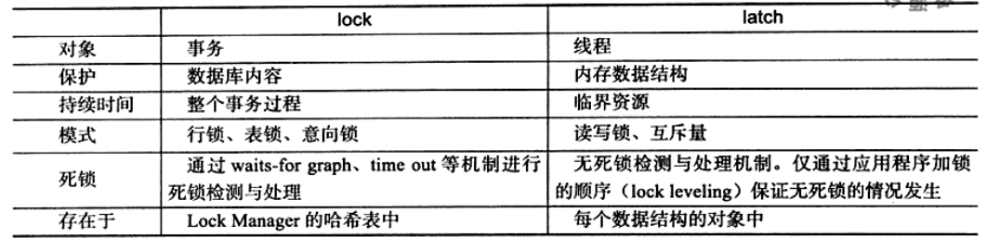
  <figcaption>Fig.6-1 lock和latch的比较。</figcaption>
</figure>

## InnoDB引擎中的锁

### 锁的类型

InnoDB实现了两种标准的**行级锁**：

* 共享锁（Shared lock）：允许事务读一行数据；

* 排他锁（eXclude lock）：允许事务删除或者更新一行数据；

兼容性：事务A对一行记录加了排他锁，则其他事务不能施加共享锁或者排他锁；事务A对一行记录施加共享锁，可以接收其他事务对同一行记录施加共享锁。

InnoDB支持**表级别**的锁：

```mysql
# mysql支持表锁
LOCK TABLE my_tabl_name READ; # 用读锁锁表，会阻塞其他事务修改表数据。
LOCK TABLE my_table_name WRITe; # 用写锁锁表，会阻塞其他事务读和写。
```

此外还支持两种意向锁：

* 意向共享锁（Intention Shared lock）：事务想要获得表中某几行的共享锁；

  > 事务对表中某一行施加行锁时，数据库会**自动**申请该行所在表的意向锁。当一个事务试图对**整个表**进行加共享锁之前，首先需要获得这个表的意向共享锁。

* 意向排他锁（Intention eXclude lock）：事务想要获得表中华某几行的排它锁；

  > 当一个事务试图对**整个表**进行加排它锁之前，首先需要获得这个表的意向排它锁。

表级意向锁、表锁和行锁的关系：

> 假设事务A对表中某行施加了行锁，并且尚未提交事务，这是表被自动施加了意向锁。
>
> 事务B申请**整个表**的写锁，会做尝试：1）是否存在其他的表（写/读）锁；2）表中的每一行是否被行锁锁定；
>
> 如果不存在意向锁，2）的校验必须扫整个表。因为发现表上有事务A的意向锁，事务B写锁会被阻塞。
>
> 意向共享锁和表共享锁兼容，其余都是互斥的

意向锁和行级锁兼容性：

IX，IS是表级锁，不会和行级的X，S锁发生冲突。只会和表级的X，S发生冲突。
两个事务申请行锁，不需要校验意向锁。

可以在INFORMATION_SCHEMA表中的InnoDB_TRX、InnoDB_LOCKS和InnoDB_LOCKSInnoDB_LOCKS_WAITS查看事务和锁的状态。

### 一致性非锁定读consistent nonlocking read

一致性-非锁定-读：指的是存储引擎通过多行版本控制的方式读取当前数据库中的数据。如果此时某行正在被修改（delete or update），读取操作并不会被阻塞，而是去读取该行的快照数据。

<figure>
  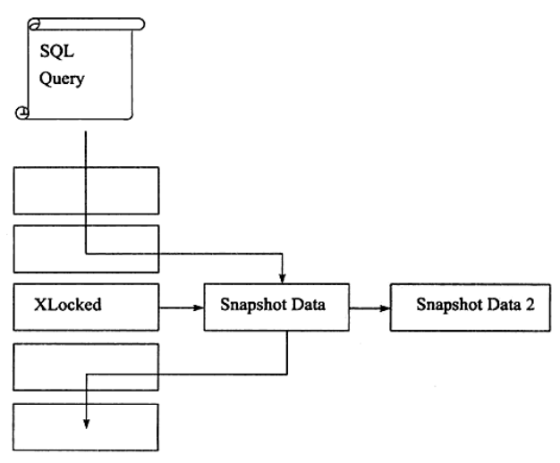
  <figcaption>Fig.6-2 InnoDB存储引擎一致性非锁定读。当某行被锁定时，会直接读取其快照数据。即读取不会占用和等待表上的锁。</figcaption>
</figure>

快照数据指的是改行之前版本的数据，该实现是通过undo实现的（undo用来在事务撤销中快速的回滚数据）。

在隔离级别为**READ COMMITTED**和**REPEATABLE READ** 下，InnoDB存储引擎使用非锁定的一致性读。

但是两种级别使用的快照数据是不一致的：

**READ COMMIT**隔离级别下，总是读取最新的快照数据，这就意味着会有**不可重复读**问题。

**REPEATABLE READ**隔离级别下，总是读取该事务开始时的快照版本。

* 多版本并发控制MVCC multi version concurrency control

  一行记录上有不同版本的数据，由此带来的并发控制，称之为多版本并发控制。

### 一致性锁定读consistent locking read

> RR + 一致性非锁定读可以解决不可重复读问题；
>
> RR + 一致性锁定读可以解决幻读问题；

为了保证数据逻辑的一致性，数据库支持加锁操作，这里应该能解决幻读问题。因为会使用next-key lock。

```mysql
# for update会对读取的行记录加一个X锁，其他事务不能对已锁定的行加任何锁；
# 通过强制加X锁，读取的数据保证不会发生变化。
SELECT ... FOR UPDATE
# 下面的语句会对读取的杭行记录加一个S锁，其他事务可以加S锁，但是X锁会被阻塞；
SELECT ... LOCK IN SHARE MODE

# 注意上使用的时候要保持在一个事务中（用begin/start transsaction开启，或者set autocommit = 0)
# 因为事务自动提交会释放锁
```

### 自增长与锁

> 这一小节讨论的问题是使用自增ID的列，插入时，自增ID的值如何确认？
>
> 一种方式是AUTO-INC Locking，语句时`select max(auto_inc_col) from t for update`, 显然这个语句会有阻塞问题；
>
> InnoDB引擎另外提供了一种轻量级互斥量的自增长实现机制，性能比较高，但是不能保证是完全连续的；此外如果binlog采用的是statement格式，则replication会有问题。

### 外键和锁

> 这一小节探讨的是跨表的锁定问题。

## 锁的算法

行锁有三种算法

* 记录锁record lock; 只对记录本行上锁；

* 间隙锁gap lock; 锁定一个范围，但是不包含记录本行；

  比如现有索引为1，3，6；条件where a = 3，则上锁范围为前后键，（1， 3）与（3， 6）

  用户是可以关闭gap lock的，只要设置隔离级别为RC或者设置InnoDB_locks_unsafe_for_binlog为1。

* next-key lock; 记录所和间隙锁的结合，锁定一个范围&对本行上锁；这里的锁指的是X锁；

行锁是对索引加锁的，next-key lock如果是对主键上锁，则会降级为记录锁。

```mysql
# 表t有主键和辅助索引列a,b；表中数据为（1，1），（3，1），（5，3），（7， 6），（10， 8）
select * from t where b = 3 for update
# 这条语句会对索引a=5上锁，然后对辅助索引施加next-key lock，锁定(1，3]和（3，6)范围。
```

**幻读Phantom problem**

同一事务下，前后执行相同的SQL语句会得到不相同的结果，第二次可能会返回第一次不存在的行。

InnNoDB存储引擎采用 RR + next-key lock 来避免幻读问题。

## 锁带来的问题

锁只会带来三个问题：脏读、不可重复读和更新丢失。

* 脏读

  脏读指的是一个事务读到了另一个事务中尚未commit的数据，这种情况常见于设置隔离级别为**READ UNCOMMITED**的数据库。

* 不可重复读

  在同一个事务中，同一个SQL语句前后读取的结果不一致，比如另一个事务提交了更新事务，这种情况常见于隔离级别为**READ COMMITED**的数据库。

  和脏读不同，不可重复读是读到另一事物已经提交的记录。所以其实还是合理的，有些数据库的默认隔离级别就是RC。

* 更新丢失

  事务的一个操作会被另一个操作覆盖，导致数据不一致。这种通常是因为多用户更新逻辑的问题。

  避免的方式就是使用一致性锁定读。保证操作期间数据不会发生任何变更。

## 锁阻塞问题

> 首先，阻塞是一个合理的现象，当一个事务需要访问加锁记录时，就应该阻塞。
>
> 阻塞的时间可以由参数`InnoDB_lock_wait_timeout`在session级别指定；
>
> `InnoDB_rollback_on_timeut`控制超时行为，默认为off不回滚；注意这个参数运行时不能修改。

## 死锁问题

指的是至少两个的事务在竞争资源的时候互相等待的过程，若没有外力的作用，参与的事务都将无法继续推进。

怎么解决死锁呐？

最简单的办法就是**超时**，当一个事务的等待时间超过阈值时，就放弃重试；这样另一个事务就能继续执行。

另外一中解决机制就是**wait-graph**，InnoDB就是采用了此种策略。这是一种主动的策略 ，如果存在死锁，则会选择回滚undo量最小的事务。

## 锁升级问题

> 锁升级问题讨论的是行锁编程页锁的类似锁范围变大的问题。
>
> 核心因素在于锁在存储引擎实现上是不是一种稀缺资源，比如一个锁需要消耗不少的内存资源。
>
> 锁升级之后，数目变少，内存自然变少，管理成本降低。

InnoDB存储引擎根据页加锁，并且采用了位图方式。因此不管一个事务锁了页中一个记录或者多条记录，其代价是一致的。

因此，InnoDB不存在锁升级的问题。

# 7. 事务

> 这个章节首先介绍了事务的ACID特性，然后介绍存储引擎对事务原子性的实现，最后给出事务的正确使用姿势。

## 认识事务

事务可由一条简单的SQL语句组成，也可以由一组复杂的SQL语句组成。

### 事务的ACID特性

理论上来说事务应该严格的满足ACID特性，但是处于各种目的，数据库厂商并不会严格的实现ACID。比如RC其实并不满足隔离性。

InnoDB中的事务完全符合ACID特性，

* Atomic原子性

  原子性指的是事务中的所有操作都是不可分割的工作单位，所有的操作都必须执行成功；否则应该回撤已经执行成功的所有操作。

  这也意味着数据库必须保护受影响的数据，能够干净利落的回撤。

* Consistent一致性

  数据库总是从一种有效状态转换到另一种有效状态。

  比如有个字段的名字要求不能重复，如果一个事务commit或者回滚的时候，使得数据库出现了相同的名字，这就使得数据库陷入了失效的状态。

* Isolation隔离性

  隔离性是说事务之间的操作不会互相影响，事务提交前对其他事务都是不可见的。

  理想的隔离状态是串行化。事务排队执行，当前事务执行完成之后才能执行下一个事务。

  第六章通过锁实现了事务之间的隔离性。

* durability持久性

  事务一旦提交其结果就是永久性的。即使发生宕机，数据库也能将数据恢复。

### 事务的分类

* 扁平事务Flat transaction

  日常使用最为频繁的事务。

  所有的操作都处于同一层次，由`BEGIN WORK`开始，以`COMMIT WORK`或者`ROLLBACK WORK`结束。

* 带有保存点扁平事务Flat Transaction wtth Savepoints

  扁平事务失败，就得回滚所有操作；带有保存点的事务，回滚时可以指定回滚某个具体的保存点。

  扁平事务默认的保存点其实是事务开始，也就是没有发生操作的状态。

  保存点是在提醒数据库记录事务当前时刻的状态。

* 链事务Chained Transaction

  保存点模型的变种。

* 嵌套事务Nested Transaction

  顶层事务控制着各个层次的事务。

* 分布式事务Distributed Transaction

  一个事务涉及到多个数据库，并且数据库之间可能时通过网络连接的。比较复杂。

## 事务的实现

事务的隔离性是由第六章提到的锁实现的；

redo log重做日志保证事务的原子性和持久性；

undo log保证事物的一致性；

> redo 和undo log都可以视为恢复操作，但是两者的记录内容不同。
>
> redo记录的是事务修改页page的物理操作，恢复时是整个页；
>
> undo记录的是行row的逻辑操作，可以回滚行记录到特定版本。

### redo

重做日志分为两部分：重做日志缓冲redo log buffer和 重做日志文件redo log file。

1. **InnoDB引擎何时将日志从缓冲刷新固化到磁盘？**

* 事务提交时

  InnoDB为了保证事务的持久性，使用Force log at commit机制：即当事务提交COMMIT时，必须先将该事务的所有日志刷新到重做日志文件，也就是说必须确保事务日志完全写到硬盘上（系统调用fsync阻塞直到数据别写入到磁盘），一个事务才算是提交成功。

  数据库允许用户在持久性和性能之间做一个平衡，参数`InnoDB_flush_log_at_trx_commit`控制事务提交时重做日志刷新到磁盘上的策略：

  0 - 表示事务提交时不进行写入磁盘操作，等待master thread每隔1s的fsync操作；

  2 - 事务提交时会将日志写入到系统缓存，但是不调用fsync操作，数据库宕机数据不会丢失，但系统宕机就会有问题；

  1 - 事务提交时会将日志写入到系统缓存，并且调用fsync操作；

* log buffer有一半的内存空间已经被使用；

* log  checkpoint时

2. 重做日志和二进制日志的区别

   binlog是用来进行PIT（point in time）的恢复已经主从复制环境的建立。二者的区别在于：

* 生产者不一致

  重做日志是InnoDB特有的日志，是在存储引擎层面产生的；而binlog是在MySQL的server层产生的，每个存储引擎对数据的修改都会生成binlog。

* 内容形式不同

  binlog记录的是逻辑的SQL语句，重做日志记录的是对页的修改，是物理格式（比如偏移量0x80，写入'aaa'）。

* 写入磁盘的时间点不同

  二进制日志只在事务提交完成后进行一次写入，而重做日志在事务进行过程中不断被写入，每个事务可能对应多个日志。

  <figure>
    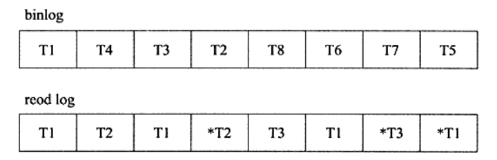
    <figcaption>Fig.7-1 binlog和重做日志写入时间点不同，事务完成后写一次binlog，而事务进行过程中会不断的写重做日志。</figcaption>
  </figure>

3. 恢复

   重做日志记录了LSN（log sequence number），重做日志的总量。另外在磁盘页中页记录了该页最后刷新时的LSN大小。

   注意，重做日志记录的是每个页的日志！因此重做日志和页中的LSN就可以用来指导页的恢复工作。

   两个有趣的点：

   1）无论数据库上次运行是否正常关闭，重启时都会进行重做日志的恢复，通过LSN确定恢复的范围；

   2）重做日志记录的是物理日志，恢复速度比二进制日志快得多。

   <figure>
     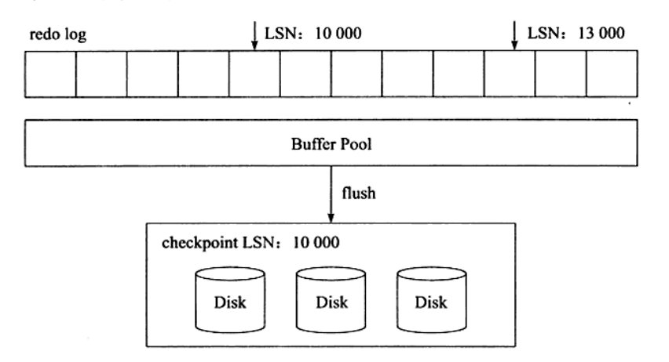
     <figcaption>Fig.7-2 假设数据库在LSN=1000的时候宕机了，重启时恢复的范围是1000~1300。</figcaption>
   </figure>

### undo

undo log用来支持回滚和MVCC特性。

undolog 记录的是逻辑日志。

undo存放在共享表空间中的undo segment，undo segment会分配页，用于写入undo log。

事务提交后（就是不需要考虑回滚的事情了）并不能立即删除undo log以及undo log所在的页，因为其他事务可能在进行一致性非锁定读，还需要通过undo log得到行记录之前的版本。

事务提交时会将undo log放入一个链表中，删除工作交由purge线程来判断。

undo log也是需要持久性的保护，因此也会产生redo log。

1. 回滚

   回滚只是说将该事务的影响消除，而不是恢复到事务刚开始时候的阶段（比如一个页可能被其他事务修改了）。

   回滚是SQL语句的逆操作，你执行insert，存储引擎就执行delete；delete就insert；update就执行相反的更新，把行写回去。

2. undo log格式

* insert undo log

  对应的是insert操作；根据事务隔离性的精神，插入操作不应该让其他事务见到，因此事务完成后就可以删除unod log。

* update undo log

  对应的是delete和update 操作，需要考虑MVCC，因此事务完成后不能直接删除，放入链表交由purge thread处理。

  什么时候删？该行记录不再被任何事务所需要。

### purge

> delete和update执行细节也是很有趣的，
>
> delete记录的主键会被标记为删除，delete flag设置为1。
>
> update如果修改主键的话，会先将原先的主键标记为删除，然后插入一条新的记录。

purge最终完成之前的delete和update操作，清理之前行记录的版本。

### group commit

事务重做日志写入的过程如下：

1）修改内存中数据的信息，并且将日志写入到重做日志缓冲buffer；

2）调用fsync，确保重做日志被刷新到磁盘重做日志文件；

fsync是比较耗时的，在等待2）时其他事务可以进行1），然后下一批一起fsync，这样就可以一次fsync，完成多个事务的日志固化。

group  commit减少了磁盘IO操作，大大提升了数据库性能。

**两阶段提交**：

把binlog考虑进来

1）事务修改内存中事务，过程中写了redolog buffer;

2）处于prepare阶段，server层fsync写入binlog日志，由参数sync_binlog控制；

3）将重做日志写入到磁盘；

4）真正commit。

两阶段提交强调binlog的写入必须在redolog file之前，否则恢复时会有问题。

group commit 会打乱2）和3）的顺序，因此开启binlog需要关闭group commit。

**Bin Log Group Commit**BLGC解决了这个问题。

核心大概是binlog先写入内存，然后调动fsync批量写入到binlog；然后group  commit。

## 事务控制语句

```mysql
# 开启事务
START TRANSACTION; # or
BEGIN;

# 提交事务
COMMIT； # or
COMMIT WORK;

# 回滚
ROLLBACK；

# 设置保存点
SAVEPOINT id;

# 删除保存点
RELEASE SAVEPOINT id;

# 指定回滚点
ROLLBACK TO SAVEPOINT id;

# 设置事务的隔离级别
SET TRANSACTION READ UNCOMMITTED;
SET TRANSACTION READ COMMITTED;
SET TRANSACTION REPEATABLE READ;
SET TRANSACTION SERIALIZABLE;
```

## 事务的隔离级别

| 隔离级别                             | 含义                                                         | 可能导致                                                 |
| ------------------------------------ | ------------------------------------------------------------ | -------------------------------------------------------- |
| ISOLATION_DEFAULT                    | 使用后端数据库默认的隔离级别                                 | MySQL默认使用REPEATABLE_READ，Oracle默认READ_COMMITTED； |
| ISOLATAION_READ_UNCOMMITTED 未提交读 | 允许读取尚未提交的数据变更                                   | 脏读、不可重复读、幻读                                   |
| ISOLATION_READ_COMMITTED 已提交读    | 允许读取并发事务已经提交的数据                               | 不可重复读、幻读                                         |
| ISOLATION_REPEATABLE_READ 可重复读   | 对同一字段的多次读取结果是一致的，除非数据是被本事务自己所修改 | 幻读                                                     |
| ISOLATION_SERIALIZABLE 可串行化      | 完成服从 ACID 隔离级别，确保阻止脏读、不可重复读、幻读。这是最慢的事务隔离级别，因为它通常是通过完全锁定事务相关的数据库来实现的 | 无                                                       |

几个有趣的事情

1）不可重复读和幻读
	前者指同一条记录前后结果不一致，后者值前后读出的记录数量不一致。

​	但是，幻读有时也包括了前者的情况，建议不要强行区分。

2）REPEATABLE READ

​	可重复读并不能解决幻读的问题，但是 RR + next key locking 就能搞定幻读问题；即达到了SQL标准的SERIALIZABLE；

3）SERIALIZABLE

​	这个隔离级别会为每个select 语句添加`LOCK IN SHARE MODE`，也就是加了共享锁。

​	因为RR+ next key locking 就能实现SERIALIZABLE的隔离级别，所以本地事务不推荐使用SERIALIZABLE。

​	SERIALIZABLE主要用于InnoDB存储引擎的分布式事务。

4）隔离级别越低，性能越高？

​	结论是不明显。RR不一定比SERIALIZABLE高，同样RC不一定比RR高；

5）RC

​	RC一般不使用gap lock。

​	RC不能和format为statement的binlog一起使用，否则会造成replication问题。

# 8. 备份和恢复

## 二进制文件replication

过程如下：

1）主服务器（master）把数据更改记录到binlog中；

2）从服务器（slave）把二进制文件复制到自己的中继日志（relay log）；

3）从服务器重做中继日志中的日志，将更改应用到数据库。

<figure>
  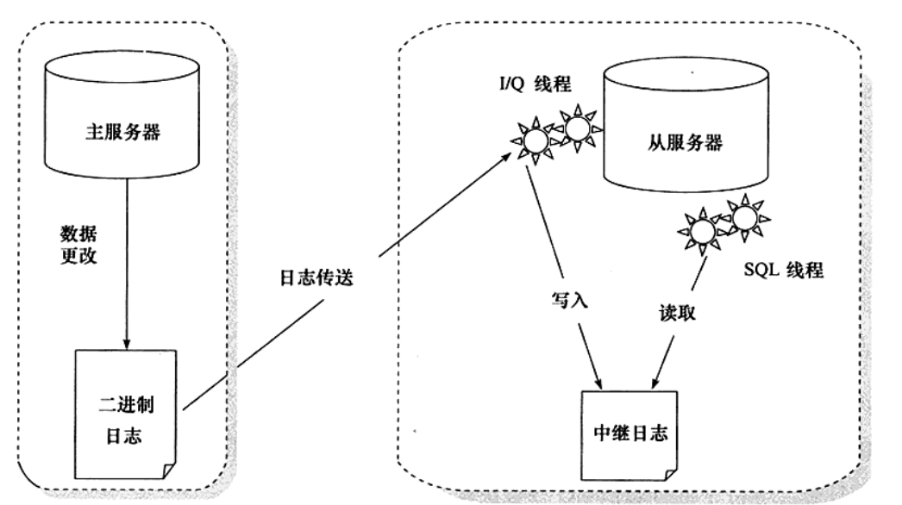
  <figcaption>Fig.8-1 主从数据库备份过程。原理就是一个完全备份+二进制日志的增量备份。</figcaption>
</figure>

快照+复制：

复制并不仅仅是用来备份的（必要时可以转化为主服务器，高峰开放访问），并且仅仅用复制来进行备份是不够的。

比如采取了主从复制，主数据库事务`drop table`，从数据库也会被动跟着运行。

<figure>
  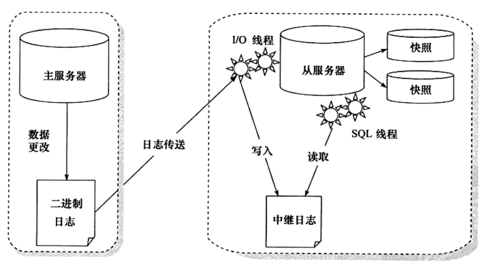
  <figcaption>Fig.8-2 快照+复制。对从服务器数据库所在分区做快照。</figcaption>
</figure>
