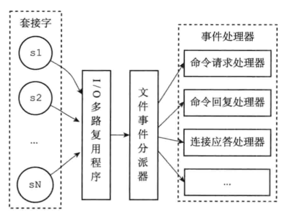
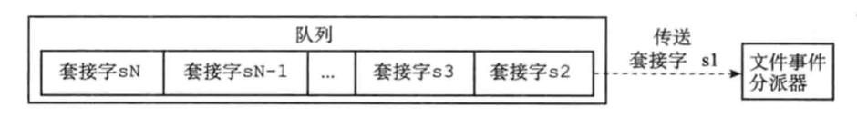
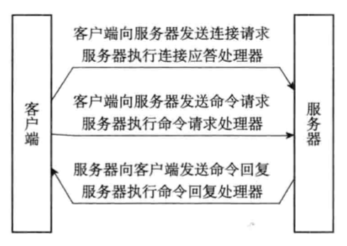
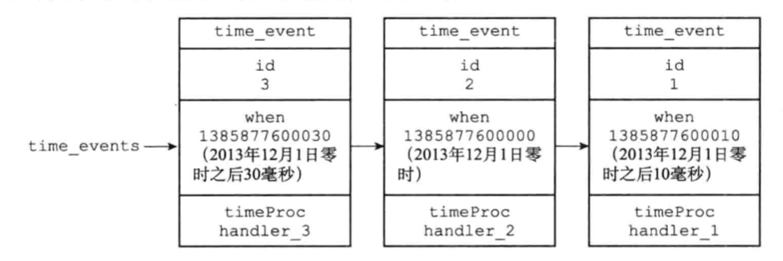
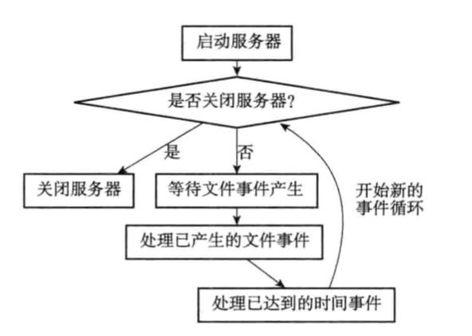

Redis 服务器是一个事件驱动服务器，服务器处理以下两类事件：

* 文件事件（file event）：Redis 服务端通过套接字和客户端进行交互，文件事件就是对套接字事件的抽象。
* 时间事件（time event）：定时事件，Redis 服务器会定时执行的事件。

这章节分别介绍两个事件，然后给出二者的调度策略。

# 1 - 文件事件（file event）

## 1.1 文件事件的类型

> 这里其实是常规的套接字编程的内容。
>
> 一开始服务器端是有一个**监听套接字**，用于响应客户端的连接请求。
>
> 客户端发起连接请求，服务端接收 accept 请求，并为这次请求创建一个新的套接字，客户端的行为会影响这个套接字的状态，按照套接字状态划分文件事件。
>
> 以下，如果没有指明是监听套接字，那么就是指的特定连接的套接字。

* `AE_READBLE`

  套接字变得可读，即对应：

  * 客户端对套接字执行 write 操作；
  * 客户端对套接字执行 close 操作；
  * 客户端对服务器端的监听套接字执行 connect 操作（即服务器端出现可应答 accept 套接字）;

* `AE_WRITABLE`

  套接字变得可写，即对应：

  * 客户端对套接字执行 read 操作；

如果一个套接字可读又可写，那么服务器将先读套接字，再写套接字。

## 1.2 事件处理器

Redis 为不同的文件事件编写了多个处理器函数，用于实现不同的网络通信需求。

| 处理器函数                        | 关联文件事件                 | 触发时机                                                  | 作用                         |
| --------------------------------- | ---------------------------- | --------------------------------------------------------- | ---------------------------- |
| 连接应答处理器acceptTcpHandler    | 监听套接字的`AE_READBLE`事件 | 当客户端发起连接 connect 请求，触发`AE_READBLE`事件       | 执行套接字应答操作（accept） |
| 命令请求处理器readQueryFromClient | 套接字`AE_READBLE`事件       | 客户端通过套接字发送命令，触发`AE_READBLE`事件            | 执行套接字读入操作（read）   |
| 命令回复处理器sendReplyToClient   | 套接字`AE_WRITABLE`事件      | 当服务端有命令回复需要传给客户端时，触发`AE_WRITABLE`事件 | 执行套接字写入操作（write）  |

## 1.3 文件事件处理架构

Redis 基于 Reactor 模式开发了自己的网络事件处理器，称之为文件事件处理器 （file eventhandler）。

文件事件处理器以**单线程**方式运行，利用 I/O 多路复用程序同时监听多个套接字，文件事件分派器根据套接字当前执行的任务，为套接字分配不同的事件处理器。

<figure>
  
  <figcaption>Fig.12-1 文件事件处理整体架构。</figcaption>
  
  <figcaption>Fig.12-2 套接字队列。I/O多路复用程序每次传递一个套接字给文件事件分发器，只有当前套接字处理完毕后，才会传递下一个套接字。</figcaption>
</figure>


Redis 的 I/O 多路复用程序是通过封装 select、epoll、evport 和 kqueue 这些 I/O 函数库实现的。

编译时，Redis 会自动选择当前系统最佳的多路复用函数作为底层实现：evport -> epoll -> kqueue -> select。


## 1.4 **一次完整的客户端与服务器连接事件**

0）Redis 服务器正在运行，监听套接字的 `AE_READBLE` 事件正处于被监听状态；

1）客户端向服务器发起连接请求，监听套接字产生 `AE_READBLE` 事件，触发连接应答处理器的执行。连接应答处理器创建客户端套接字，以及客户端状态，并将客户端套接字的`AE_READBLE`事件与命令请求处理器进行关联，此时客户端被允许向服务端发送命令请求（连接建立）

2）客户端向服务器端发送一个命令请求，客户端套接字产生`AE_READBLE`事件，引发命令请求处理器执行。命令请求处理器读取套接字的内容，然后传递给相关程序去执行。执行命令将产生相应回复，服务端需要先将套接字的`AE_WRITABLE`事件与命令回复器进行关联。

3）当客户端尝试读取命令回复时，客户端套接字产生`AE_WRITABLE`事件，触发命令回复处理器执行。命令回复处理器执行写入命令，写入完毕后，解除`AE_WRITABLE`事件与命令回复处理器的关联。

<figure>
  
  <figcaption>Fig.12-3 客户端和服务端的通信过程。</figcaption>
</figure>


# 2 - 时间事件

## 2.1 基本属性

Redis 时间事件可以分为两类：

* 定时性事件

  让一段程序在指定的时间执行一次。

* 周期性事件（**目前 Redis 只有周期事件**）

  让一段程序每隔一定时间就执行一次。

时间事件有三个属性：

* `id`

  时间事件的全局唯一标识号，按照从小到大递增，新的事件比旧的事件id大。
  
*  `when`
	
	毫秒精度的时间戳，记录了时间事件的到达（arrive）时间。
	
* `timeProc`

  时间事件处理器，回调函数，当时间到达时就执行该程序。

## 2.2 实现

Redis 使用无序链表（无序指的是没有按照到达时间`when`排序）实现时间事件。每当时间事件执行器运行时，它就遍历整个链表，查找所有已到达的时间事件，并调用对应的 timeProc 处理。

目前，只有一个周期性事件`serverCron`，所以无序链表并不会影响事件处理器的性能。

<figure>
  
  <figcaption>Fig.12-4 用链表连接起来的三个时间事件。</figcaption>
</figure>


那么唯一的时间事件`serverCron`是干什么的？

检查和调整自身的资源和状态，默认 100ms 运行一次。

* 更新服务器的各类统计信息，比如时间、内存占用、数据库占用情况等；
* 清除数据库中的过期键值对；
* 关闭和清理连接失效的客户端；
* 尝试进行 AOF 或者 RDB 持久化操作；
* 如果服务器是主服务器，需要定期对从服务器同步；
* 如果处于集群模式，对集群进行定期同步和连接测试；

# 3 - 时间的调度与执行

Redis 服务器中同时存在文件事件和时间事件，服务器需要指定调度策略。

执行规则：

1）I/O 多路复用函数阻塞的时间由到达时间最接近当时时间的时间事件决定。这样既可以避免服务器频繁的轮询时间事件，也确保 I/O 多路复用函数不会阻塞过长时间。

2）对文件事件和时间事件都是同步（阻塞）、有序、原子地执行的，服务器不会中断事件，也不会抢占事件。如果一个事件过于耗时，则会主动退出。比如文件事件写入套接字的字节数超过阈值，则会先 break，等待下次写；比如复杂的时间事件可能会另起一个线程或者进程执行。

3）时间处理事件执行时间可能会略迟于设定的到达时间。

```python
def main():
  init_server()  # 初始化服务器
  # 一直处理事件，直到服务器关闭为止
  while server_is_not_shutdown():
 	  aeProcessEvents();  # 实现见下文
  clean_server()  # 关闭服务器
```

```python
def aeProcessEvents():
  time_event = aeSearchNearestTimer()  # 获取到达时间距离当前时间最接近的时间事件
  remained_ms = max(0, time_event.when - unix_ts_now())  # 计算当前时间差异
  time_val = create_timeval_with_ms(remained_ms) # 根据剩余时间创建 timeval 结构
  aeApiPoll(timeval)  # I/O 多路复用函数等待时间发生，如果等待时间为零，则立刻返回
  processFileEvent()  # 处理就绪的文件事件
  processTimeEvent()  # 处理所有已到达的时间事件
```

<figure>
  
  <figcaption>Fig.12-5 事件处理角度下的服务器运行流程。</figcaption>
</figure>


4 - 总结

* Redis 服务器是一个事件驱动程序，服务器的事件分为文件事件和时间事件两大类；
* 文件事件处理器是基于 Reactor 模式实现的网络通信程序；
* 文件事件是对套接字的抽象：每次套接字变为可应答（accepted）、可读（readble）或者可写（writable）的时候，相应的文件事件就会产生；
* 文件事件分为 `AE_READBLE` 与 `AE_WRITABLE` 两类；
* 时间事件分为定时性事件和周期性事件两类，前者只在指定的时间执行一次，后者周而复始的执行；
* 目前 Redis 只有一个周期性事件 `serverCron`，负责检查和调整自身的资源与状态；
* 文件事件和周期事件之间是合作关系，服务器会轮流处理这两种事件，并且事件处理过程中也不会互相抢占；
* 时间事件的实际处理时间通常会比设定的到达时间晚一些；

