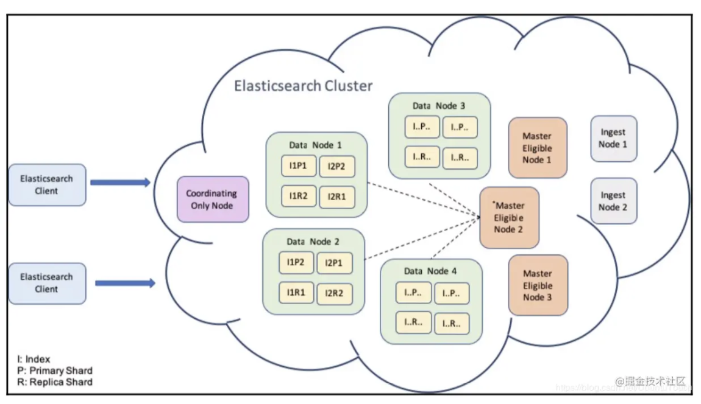
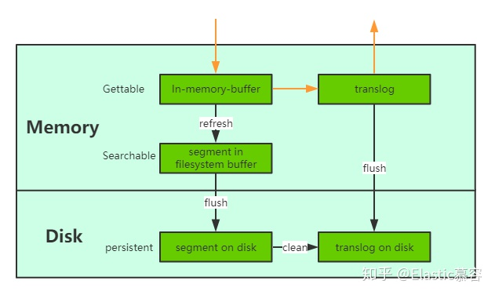

# 0 - 简介

ElasticSearch 是一个分布式的使用 REST 接口的搜索引擎。

ES 和 [Logstash ](https://link.juejin.cn/?target=https%3A%2F%2Fgithub.com%2Felastic%2Flogstash)（数据的采集和处理） 及 [Kibana](https://link.juejin.cn/?target=https%3A%2F%2Fgithub.com%2Felastic%2Fkibana)（数据的展示、分析和管理） 构成了 **ELK **软件栈。

ES 有以下几个特性：speed、scale 和 relevance

1）ES 使用 [Apache Lucene](https://link.juejin.cn/?target=http%3A%2F%2Flucene.apache.org%2F) 建立索引并实现搜索功能，并且通过 RESTful API 使得全文搜索变得简单，隐藏了 Lucene 底层复杂性；
	快速（**speed**）搜索并且按照分数排序，返回最相关（**relevance**）的结果。

2）分布式的实时文件存储，每个字段都被建立索引并支持搜索；

3）实时分析的分布式搜索引擎；
	新写入的数据等候一秒便可以被检索到。当一个文档写入 Lucene 后是不能被立即查询到的，ES 提供了一个 refresh 操作，为内存中新写入的数据生成一个 segment，使能被搜索到。

4）易扩展，可以处理 PB 级别的结构化和非结构化数据；
	ES 的 cluster 是一种分布式的部署，极易扩展（**scale**)。这样很容易使它处理 PB 的数据库容量

ES 较为复杂，但是至少需要回答三个问题：

* ES 数据规模很大时为什么还能维持快速的搜索？

* ES 怎么扩展？

* 如何判断文档的相关性？

# 1 - 基本概念

## doc（文档）、type（类型）和 index（索引）

ES 中每一条记录被称之为 `doc`，如果 `docs` 之间格式相同，则它们具有相同的 `type`，而 `index` 就是 `doc` 的容器。

类比于关系型数据库的话，`index` 就是一张表，`doc` 相当于表中的一条记录 record，`type` 相当于表的结构；

ES 中搜索的最小单位是 `doc`，`doc` 由字段和值构成（可以理解为 json 形式），具有一定的结构；但是其结构是非常灵活的，文档可以省略或者新增某些字段。

`type` 是文档的逻辑容器，每种 `type`  的字段定义被称之为映射（mapping）。ES 的特点是 schemaless，插入数据前不需要预先定义数据结构，ES 动态识别 `doc` 中的字段类型，生成 mapping；在以后的数据中可以新增某些字段，产生新的 smapping。

`index` 是有一个或者多个 `doc` 构成。

```bash
# 通过 POST 和 PUT 写入数据，前者 ES 会自动生成 _id，后者指定 _id
curl -XPOST 'localhost:9200/logs/my_app' -H 'Content-Type: application/json' -d'
{
	"timestamp": "2018-01-24 12:34:56",
	"message": "User logged in",
	"user_id": 4,
	"admin": false
}
'
# 返回结果为：
# {"_index":"logs","_type":"my_app","_id":"ZsWdJ2EBir6MIbMWSMyF","_version":1,"result":"created","_shards":{"total":2,"successful":1,"failed":0},"_seq_no":0,"_primary_term":1}

curl -X PUT 'localhost:9200/app/users/4' -H 'Content-Type: application/json' -d '
{
  "id": 4,
  "username": "john",
  "last_login": "2018-01-25 12:34:56"
}'
# 返回结果：
# {"_index":"app","_type":"users","_id":"4","_version":1,"result":"created","_shards":{"total":2,"successful":1,"failed":0},"_seq_no":0,"_primary_term":1}
```


注意，在 ES 6.0以后，一个 `index` 只能含有一个 `type`，默认为 `_doc`。

> [原因](https://www.elastic.co/guide/en/elasticsearch/reference/6.7/removal-of-types.html)有两点：
>
> * 一个 `index` 的不同 `type` 下的相同字段在 Lucene 内部是被同一个字段支持，如果一个是 `date`，一个是 `boolean` 类型，则无法兼容；
> * 此外一个 `index` 的两个 `type` 拥有很少（或者全无）相同的字段，则会影响 Lucene 的压缩效率。


## shard（分片）、节点（node）和集群（cluster）

前面提到，ES 支持 PB 级别的数据，如此大规模的数据无法放到一个磁盘内（或者及时能放得下，搜索也会变得很慢）；

事实上 ES 会将 `index` 分片，将数据分配到多个节点 `node`。每个 `shard` 是一个功能完善并且独立的索引。

分片意义重大：

1）允许水平扩展容量；

2）允许在不同分片上并行操作，提高性能或者吞吐量；

分片有两种类型：

* primary shard （**可扩展性**）

   `index` 创建时可以指定主分片的数目，一旦创建就无法变更。

* replica shard （**高可用**）

  一个主分片可以有另个或者多个分片，如果主分片故障，副分片就可以提拔成为主分片。默认一个 `index` 有五个主分片，每个主分片有一个副分片。

一个分片存在于一个节点，一个节点包含多个分片，主副分片会被存储在不同节点上；

一个 ES 集群包含了一个或者多个节点，一个服务器上一般运行一个 node。

节点按照功能 `node.roles`划分：

1）master-eligible 主节点，负责整个集群：添加/删除 node、为 node 分配 shard、创建/更新/删除 index；

2）data 数据节点，可以看到一个 node 上包含了多个主副分片；

3）ingest node 和 [ingest  pipiline](https://www.elastic.co/guide/en/elasticsearch/reference/current/ingest.html) 相关，一个 `doc` 可能需要先预处理（大小写、字段提取等）再插入。

4）machine learning node；

5）coordinating node 协调节点，如果节点没被明确指定职责，则负责接收外部请求并转发到相关 node；比如说一个搜索请求，协调节点将请求转发给各个数据节点，然后 reduce 内部节点的结果，返回给外部。

<figure>
  
  <figcaption>Fig.2-1 ES 集群 cluster 布局。一个集群包含了多个各司其职的 node。</figcaption>
</figure>


# 2 - 写入和搜索过程

## 写入过程：

1）协调节点接收到写或者更新请求，如果需要进行 ingest  pipiline，则将其转发到相应的节点进行预处理；

2）根据 `_routing` 字段找到对应的 primary  shard，并将请求转发给 primary shard；
	分片路由公式：`shard_num = hash (_routing) % num_primary_shards`

3）primary shard 完成写入后，将请求发到 replica shard，并且等待 replica shard 写入完成后的回执；

4）当 replica shard 回复后，primary shard 再将请求返回给协调节点。

## 搜索过程：

搜索过程分为两个阶段：scatter phase （1 -3）和 gather phase（4 - 5）。

1）协调节点接收搜索请求，并将搜索请求转发到每个主分片或者副分片（保证读操作负载均衡）；

2）每个分片返回一个轻量级优先队列给协调节点，优先队列中包含文档 ID 和排序值 score；（分片加速了搜索过程）

3）协调节点合并分片级别的搜索结构，得到全局搜索结果；

4）协调节点确认需要的文档并向相关的分片发送 GET 请求；

5）当所有文档都被取回时，协调节点合并成一个回复，返回给外部。

# 3 - 一些思考

* 分布式设计

  为了支持海量数据的存储和查询，ES 引入分片的概念，将一个 `index` 分配到多个 shard。

  ES 通过**分片预分配**实现水平扩容，当加入一个节点 node  时，ES 会自动将分片分配到新增的节点。由于文档路由算法限制，不能修改分片数目。一个 `index` 默认五个分片，这意味着最多可以将分片分散到五个节点。（**可扩展性**）

  分片分为主分片和副分片，副分片在主分片故障的时候可以顶上成为主分片。（**高可用**）

* 数据存储可靠性

  translog + 定时 flush + 副本机制。

  新写入的文档被 Lucene 暂存在内存中，如果此时发生宕机，内存中的数据将不可回复。为此，ES 新增了一个 translog，当文档被写入到 Lucene 之后，会将数据再写入到 translog。

  每隔半小时或者 translog 达到一定大小时，将内存中的数据 flush 到磁盘生成 segment，然后清除translog。

  <figure>
    
    <figcaption>Fig.3-1 translog 和定时的 flush 保证缓存中的数据不会丢失。refresh 默认间隔为1s，磁盘可能产生多个segment 碎片，需要定时merge。</figcaption>
  </figure>


* 全文索引

  解决非结构化数据检索的问题。

  正排索引可以通过 id 查找到对应的文章，但是无法通过给的部分内容如 `love`,找出含有该关键字的文档。

  倒排索引会先对文档进行分析将其拆分成单个 Term, 并存储包含该Term的文档 id，这样便可以实现通过内容查找对应文档。

  比如搜索包含 `love` 的文档，`love`出现的次数越多，则其相关性可能就越高。

# 参考文献

1. [深入理解 ElasticSearch 写入过程](https://zhuanlan.zhihu.com/p/94915597) 非常有深度的文章。
2. [You know, for search--带你认识Elasticsearch](https://zhuanlan.zhihu.com/p/96076150) ES 全文搜索基本原理以及基于 Lucene 的改进。
3. [Elasticsearch中的一些重要概念](https://juejin.cn/post/6844904024357994504#heading-1) ES  基本概念介绍。

