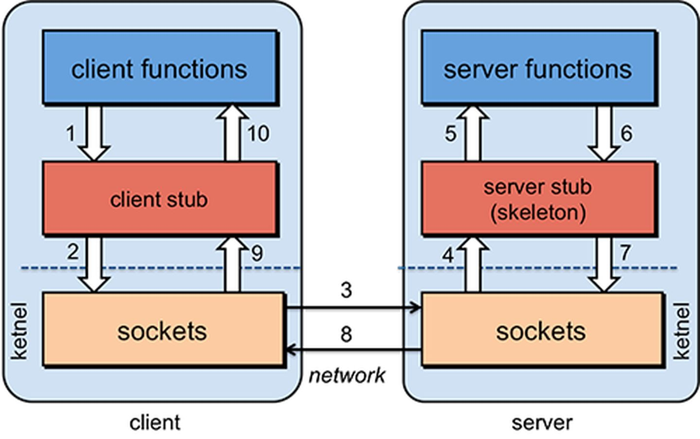

> 贵司 RPC 服务封装的太好了，远程调用过于自然，码代码时浑然不觉。

# 0 - 简介

远程过程调用 RPC（Remote Procedure Call）是进程之间的一种通信方式，允许进程调用另一个地址空间（通常是共享网络的另一台机器上）的过程或函数。RPC 忽略了底层通信细节，使得调用者如同是在调用本地函数。

RPC 的主要目标是使得**构建分布式计算（应用）更容易**，在提供强大的远程调用能力时**不损失本地调用的语义简洁性**。

为实现该目标，RPC 框架需提供一种透明调用机制让使用者不必显式的区分本地调用和远程调用。

# 1 - RPC 模型

执行 RPC 的步骤如下图 1 - 10 所示，调用者执行了步骤 1，就直接得到了 10 的返回结果。而其中 2 - 8 所包含的数据封装、发送、接收和解析过程都被隐藏了。

RPC 有几个关键点：

* 通信问题：客户端和服务端需要交换数据，通信协议不限（TCP 和 UDP 协议都可，gRPC 用的 HTTP2）
* 服务发现：建立连接之前，客户端需要知道服务端具体的 IP 地址和端口号，通常需要将服务信息给到注册中心；
* 数据处理 marshaling：数据（调用参数和结果）需要序列化为二进制格式或者反序列化为明文；

<figure>
  
  <figcaption>Fig.1-1 执行 RPC 的步骤。</figcaption>
</figure>

# 2 - 常见问题

## 2.1 RPC 和 HTTP 的比较

这两个其实不是一个层面的概念，RPC 是为了解决不同协议之间的调用问题，涉及到传输协议 + 序列化协议。传输协议支持 TCP、UDP 和 HTTP。而 HTTP 是传输协议层面的概念。

## 2.2 传输协议：TCP 和 HTTP

RPC 的 TCP 方式主要用于公司内部的服务调用，性能消耗低（自定义序列化方法），传输效率高（请求报文体积占比小）。HTTP （json 格式数据）主要用于对外的异构环境，浏览器接口调用，APP接口调用，第三方接口调用等。

但是 [gRPC ](https://grpc.io/docs/what-is-grpc/introduction/) 使用了 HTTP2 作为通信协议，二者的差异可能不明显（不重要）。

# 参考文章

1. [Remote Procedure Call](https://people.cs.rutgers.edu/~pxk/417/notes/rpc.html) 较为全面。

