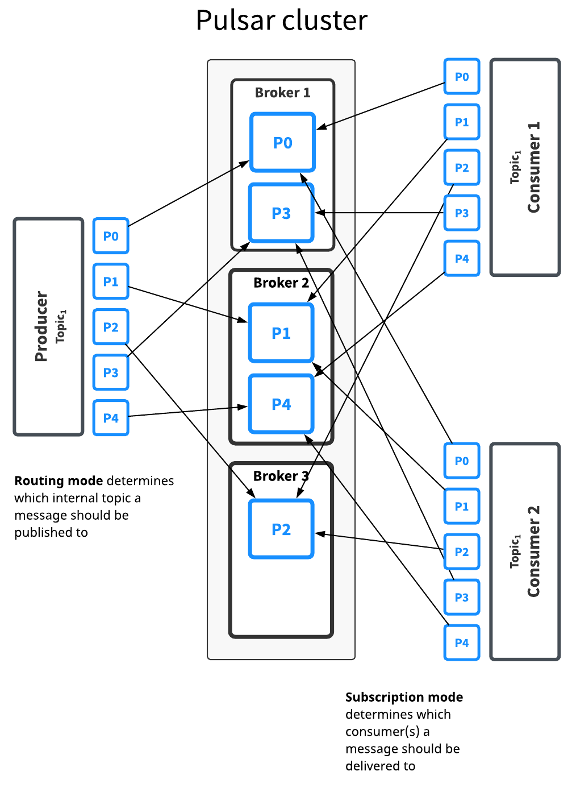

> 工作中接触到的第一个消息中间件。

# 0 - 简介

消息中间件，服务和服务之间的信息传递，即 server to server messaging。

消息中间件是分布式服务中的一个重要组件，能够提供**应用解耦**、**流量削峰**、**异步通信**和**数据同步**的功能。

Pulsar messaging 属于**发布-订阅**方式 （pub-sub pattern）。该模式下，`producers` 推送消息 `messages` 到指定的主题 `topics`， `consumers` 订阅 `topics`，处理并确认（ACK）到来的 `messages` 。

# 1 - 整体架构

Pulsar 整体架构如下图所示，有三大组件：

* `broker ` 暴露 REST 接口，连接 `producers` 和 `consumers`；不需要存储数据，因此水平扩展更容易。

  可以理解为计算服务。如果一个 `broker` 失败，Pulsar 会自动将其拥有的主题分区移动到群集中剩余的某一个可用 `broker` 中。

* `bookies` 主要用于数据的持久化存储。

* `zookeeper` 用于存储  `broker` 和 `bookies` 的元数据、集群配置等。（configuration-related and coordination-related tasks）

<figure>
  
  <figcaption>Fig.1-1 Pulsar 整体架构。</figcaption>
</figure>

<figure>
  
  <figcaption>Fig.1-2 Pulsar 和其他消息系统最根本的不同是采用分层架构，计算和服务分开。Pulsar 的消息服务层 brokers 和消息存储层 bookies。</figcaption>
</figure>

# 2 - 消息模型（subscription mode）

按照一个主题下的消息的消费方式（有/无序、独占/共享），可以分为两种订阅方式：

* **queueing**

  该模式采用**无序**或者**共享**的方式消费消。一个主题下有多个消费者，每个消费者都有可能接收和消费一条消息，但是同一条消息只会被发给一个消费者。

  适合于对消息顺序无感的应用（**无状态应用**），该模式容易扩展并行消费。

  RabbitMQ 采用了这种消费方式。Pulsar 的 `shared` 或者 `key-shared` 也属于这种模式，`key-shared` 按照消息中 key 的某种规则分发给消费者。

* **streaming**

  该模式强调消费的**有序**或**独占**，同一个主题下只有一个消费者。

  如果消息的顺序影响应用结果（**有状态应用**），则只能选择这种方式。

  Pulsar 的 `exclusive` 和 `failover`模式属于该消费模式，`failover` 有备用消费者，特殊情况下可以顶替主消费者。

  <figure>
    
    <figcaption>Fig.2-1 Pulsar 的 subscription mode 分类。</figcaption>
  </figure>

# 3 - `topics` 分区与路由模式

通常一个主题只需有一个 `broker` 处理，但是这样会限制主题的吞吐量（throughput）。

`partiton topic` 实际上被划分为多个内部的 `topic`，生产者写入时会被路由到某个内部 `topic`。

路由模式（routing mode）决定了消息会被推送到哪个分区（internal topics）。

Pulsar 支持三种方式：

* **RoundRobinPartition**

  消息中有携带 key 的话，直接哈希。

* **SinglePartition**

  消息中有携带 key 的话，直接哈希。

  没 key 的话，`producer` 随机挑选一个分区，之后的所有消息都会被推送到这个分区（single）。

* **CustomPartition**

  用户指定路由方式。

  <figure>
    
    <figcaption>Fig.3-1 Pulsar 的 路由方式。路由方式影响分区数目和路由方式，应用的特性（有/无状态）决定订阅方式。</figcaption>
  </figure>

