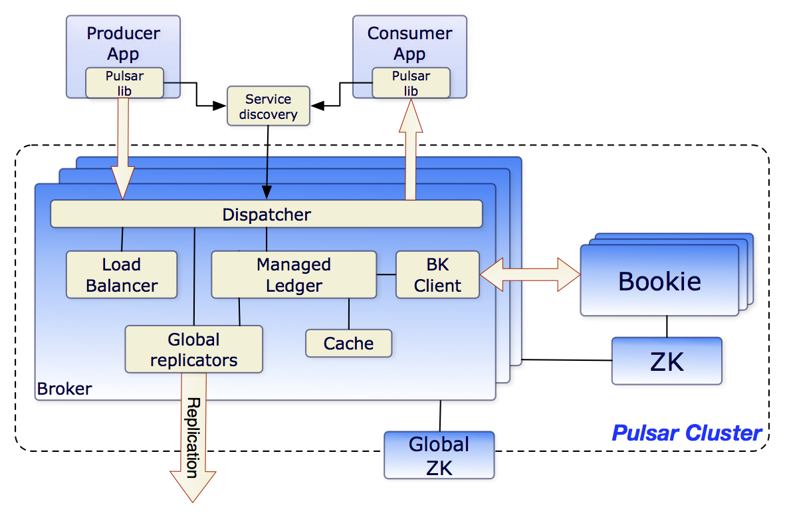

> 工作中接触到的第一个消息中间件。
>
> 最大特点是计算和存储分离（湖光和秋月分隔）+ 分片存储。

# 0 - 简介

消息中间件，服务和服务之间的信息传递，即 server to server messaging。

消息中间件是分布式服务中的一个重要组件，能够提供**应用解耦**、**流量削峰**、**异步通信**和**数据同步**的功能。

Pulsar messaging 属于**发布-订阅**方式 （pub-sub pattern）。该模式下，`producers` 推送消息 `messages` 到指定的主题 `topics`， `consumers` 订阅 `topics`，处理并确认（ACK）到来的 `messages` 。

# 1 - 整体架构

Pulsar 整体架构如下图所示，有三大组件：

* `Broker ` **无状态服务层**，负责接收和传递消息；不需要存储数据，因此水平扩展更容易。

  可以理解为计算服务。如果一个 `Broker` 失败，Pulsar 会自动将其拥有的主题分区移动到群集中剩余的某一个可用 `Broker` 中。

* `Apache Bookkeeper` 分布式的 WAL 系统，由一组名为 `bookies` 的存储节点组成，主要用于数据的持久化存储。

* `Zookeeper` 用于存储  `Broker` 和 `bookies` 的**元数据**、集群配置等。（configuration-related and coordination-related tasks）

<figure>
  
  <figcaption>Fig.1-1 Pulsar 整体架构。</figcaption>
</figure>

## 1.1 计算和存储分离

与传统的消息系统相比，Apache Pulsar 在架构设计上采用了**计算与存储分离**的模式，Pub/Sub 相关的计算逻辑在 Broker 上完成，数据存储在 Apache BookKeeper 的 Bookie 节点上。

<figure>
  
  <figcaption>Fig.1-2 Pulsar 分层架构，计算和存储分开。</figcaption>
</figure>

## 1.2 分片存储

一个 `topic` 有多个主题分区（partition topic），每个分区实际的存储单位为分片（segment）。每个 segment 作为 Apache BookKeeper 集群中的一个 `ledger`，具有三个副本，均匀分布在 `bookies` 中。

不同于常见的分区数据本地存储，Pulsar 采用分片存储，存储粒度比分区更加细化，存储负载更加均衡。

<figure>
  
  <figcaption>Fig.1-3 Pulsar 分片存储。分区实际存储单位是 segment（三个副本），均匀分布在 bookies 中。</figcaption>
</figure>

# 2 - 架构优势

## 2.1 可扩展性

消息服务层和持久存储层彼此解耦，二者可以独立扩展。

* 消息服务层 `broker`

  服务层的扩容通过增加 `broker` 实现，`broker` 是无状态组件，可以快速扩容。

  Pulsar 支持自动的分区负载均衡。一个 `broker`对应特定的一些分区，当分区资源紧张的时候，Pulsar 会自动将负载迁移到利用率较低的 `broker`。

* 持久存储层 `bookies`

  存储层的扩容可以通过增加 `bookies` 实现，通过**资源感知和数据放置**策略，流量将自动切换到新的 `bookies` 中。

  扩容过程不涉及到数据的迁移，即旧数据不需要搬迁到新的 `bookie` 中。
  
  分片存储解决了分区**容量受限和数据倾斜**的问题。
<figure>
  
  <figcaption>Fig.2-1  存储层扩容。扩容后，新增的 segment 会优先放置在新的 bookies 中，旧数据不需迁移。</figcaption>
</figure>

## 2.2 可用性

* 消息服务层

  当一个 `broekr`出现故障，`consumer` 与 `producer`会去请求同一主题下的 `broker`。这个过程中会触发分区的所有权转移，故障的`broker`下的数据的所有权将被转移给新的`broker`，注意同样不需要进行数据拷贝。
<figure>
  
  <figcaption>Fig.2-2 broker 容错。broker2 出现故障，请求转移到了 broker3。broker2 分区的所有权转移到 broker3，新的数据到来存储在了新的分片 x + 1 上。</figcaption>
</figure>
* 持久存储层

  如果是 `bookies`上的某个 segment 失败，则只进行 segment 级别的数据恢复，故障分片可以从其他两个副本的数据进行恢复。

  如果是 `bookie` 节点失败，则其上所有的 segments 都需要被修复，并存储到新的 `bookie` 。

  上述副本修复的过程都在后台，对 `broker`和副本透明。
<figure>
  
  <figcaption>Fig.2-3  存储容错。</figcaption>
</figure>

# 3 - 特性

## 3.1 读写过程

**写入过程**：

1）数据首先被写入到 journal，写入 Journal 的数据会实时落到磁盘；

2）然后数据被写入到缓存 MemTable；

3）写入到 MemTable 后响应写请求；

4）MemTable 写满会 FLush 到 Entry Logger （保存数据）和 Index Cache （保存数据索引信息），后台线程会将 Entry Logger 和 Index Cache  中的数据落到磁盘。

**消费过程**：

1）Tailing Read 直接从 MemTable 中读取；

2）否则（catch-up read）获取索引信息，然后从Entry Logger 中获取数据。

  <figure>
    
    <figcaption>Fig.3-1 Pulsar 读写过程。</figcaption>
  </figure>

## 3.2 - 消息模型（subscription mode）

按照一个主题下的消息的消费方式（有/无序、独占/共享），可以分为两种订阅方式：

* **queueing**

  该模式采用**无序**或者**共享**的方式消费消。一个主题下有多个消费者，每个消费者都有可能接收和消费一条消息，但是同一条消息只会被发给一个消费者。

  适合于对消息顺序无感的应用（**无状态应用**），该模式容易扩展并行消费。

  RabbitMQ 采用了这种消费方式。Pulsar 的 `shared` 或者 `key-shared` 也属于这种模式，`key-shared` 按照消息中 key 的某种规则分发给消费者。

* **streaming**

  该模式强调消费的**有序**或**独占**，同一个主题下只有一个消费者。

  如果消息的顺序影响应用结果（**有状态应用**），则只能选择这种方式。

  Pulsar 的 `exclusive` 和 `failover`模式属于该消费模式，`failover` 有备用消费者，特殊情况下可以顶替主消费者。

  <figure>
    
    <figcaption>Fig.3-2 Pulsar 的 subscription mode 分类。</figcaption>
  </figure>

## 3.3 - `topics` 分区与路由模式

通常一个主题只需有一个 `Broker` 处理，但是这样会限制主题的吞吐量（throughput）。

`partiton topic` 实际上被划分为多个内部的 `topic`，生产者写入时会被路由到某个 `internal topic`。

路由模式（routing mode）决定了消息会被推送到哪个分区（internal topics）。

Pulsar 支持三种方式：

* **RoundRobinPartition**

  消息中有携带 key 的话，直接哈希。

* **SinglePartition**

  消息中有携带 key 的话，直接哈希。

  没 key 的话，`producer` 随机挑选一个分区，之后的所有消息都会被推送到这个分区（single）。

* **CustomPartition**

  用户指定路由方式。

  <figure>
    
    <figcaption>Fig.3-3 Pulsar 的 路由方式。路由方式影响分区数目和路由方式，应用的特性（有/无状态）决定订阅方式。</figcaption>
  </figure>

## 3.4 ACK 方式

确认意义在于消息不丢失也不会重复处理，当消费者从故障中恢复时，能明确消费的起始位置。

* 逐条确认（individual ack）确认每条消息。
* 累计确认（cumulative ack）只需确认收到的最后一条消息。

# 参考文章

1. [Pulsar Overview](https://pulsar.apache.org/docs/en/concepts-overview/) Pulsar Yahoo 官方文档；
2. [Pulsar(新一代高性能消息系统)核心总结](https://lxkaka.wang/pulsar/#top) 
3. [Comparing Pulsar and Kafka: How a Segment-Based Architecture Delivers Better Performance, Scalability, and Resilience](https://www.splunk.com/en_us/blog/it/comparing-pulsar-and-kafka-how-a-segment-based-architecture-delivers-better-performance-scalability-and-resilience.html) 

