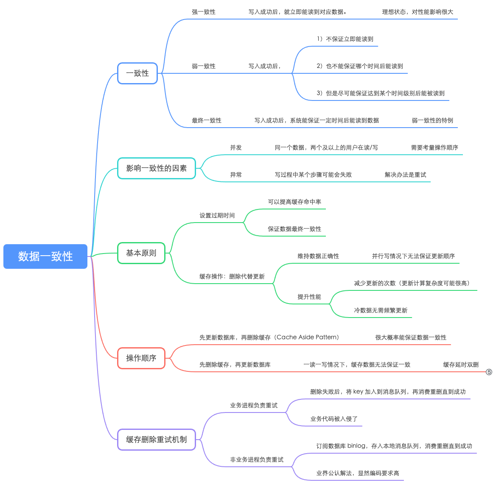
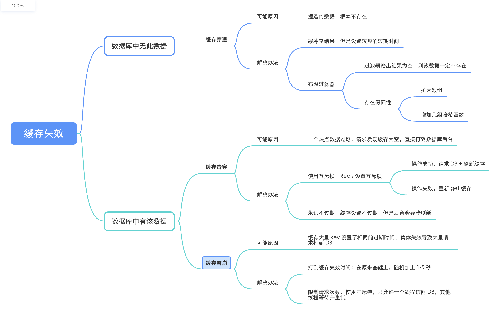

> 缓存适用于读多写少（8-2）的场景，通过访问缓存而非数据库提升了处理读请求的速度。然而，却对数据库的一致性带来了挑战。这篇文章主要探讨数据不一致的原因以及可能的解决办法。此外，也一并整理缓存常见的三大问题。

# 1-数据一致性

[数据一致性](https://note.youdao.com/s/SJ85I3UA)

<figure>
  
  <figcaption>Fig.1 数据一致性。</figcaption>
</figure>

# 2-缓存三大问题

[缓存三大问题](https://note.youdao.com/s/OglRzOSR)

<figure>
  
  <figcaption>Fig.2 缓存三大问题以及解决办法。</figcaption>
</figure>
