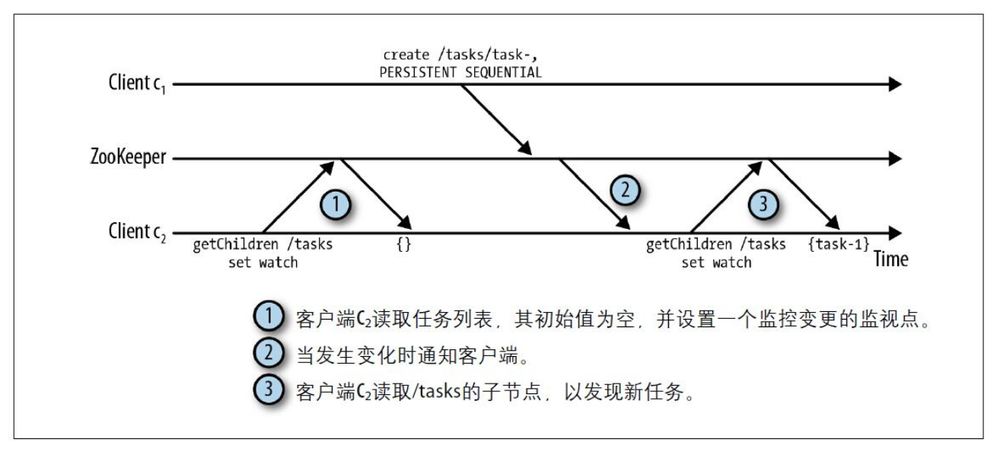
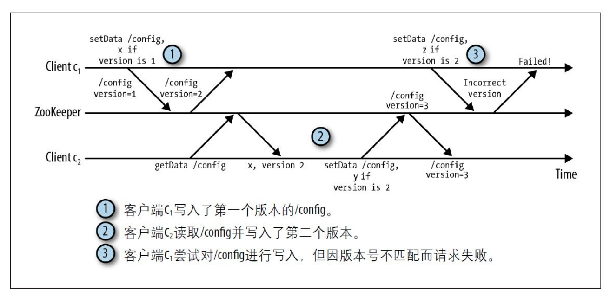
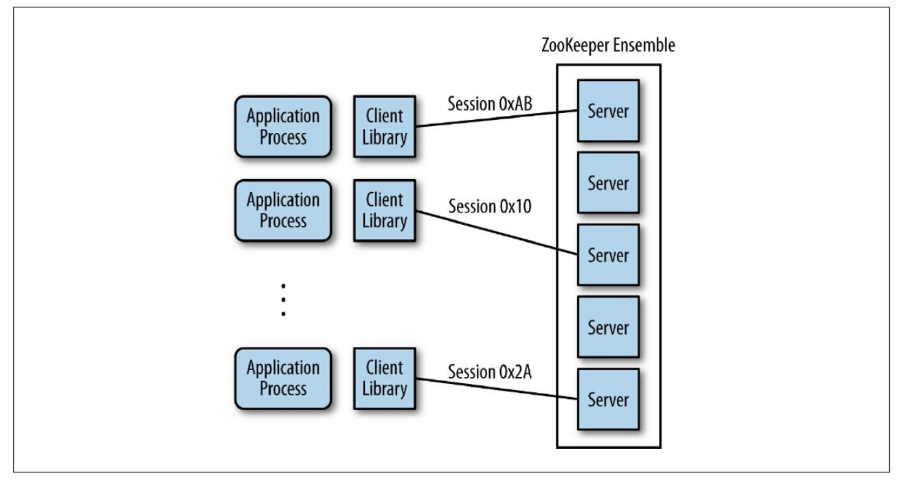
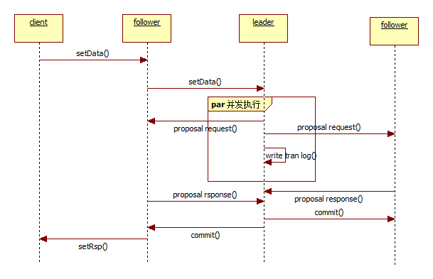

> Zookeeper 是什么？一个数据存储中心，数据以目录的形式进行组织。
>
> Zookeeper 用于分布式服务节点的协调和管理。

# 1 - Zookeeper 基础

## 1.1 API 概述

znode  节点可能含有数据，也可能没有。

如果存在数据则以字节数组（byte array）的形式保存。

客户端连接到 Zookeeper 的时候，会创建会话（session）。

```bash
# 创建一个名为 /path 的 znode 节点，并包含数据 data;
create /path data

# 删除名为 /path 的 znode;
delete /path

# 检查是否存在
exist /path

# 设置数据
setData /path data

# 返回节点数据信息
getData /path

# 返回 /path 的所有子节点列表
getChildren /path
```

## 1.2 znode 类型

当新建 znode 时，还需要指定该节点的类型（mode），不同的类型决定了 znode 节点的行为方式。

节点主要有两个属性：持久化/非持久化、有序/无序。

因此，目前 znode 有四种类型：**持久有序**、**持久无序**、**临时有序**和**临时无序**。

### 持久节点（persistent）

持久的节点只能通过 `delete` 命令删除。

可以通过持久类型的 znode 为应用保存一些数据，即使 znode 的创建者可能已经不在这个系统了。

### 临时节点（ephemeral）

临时节点在以下两种情况下会被删除：

* 当创建该 znode 的客户端的会话因超时或主动关闭而中止时；
* 当某个客户端(不一定是创建者)主动删除该节点时；

### 有序节点（sequential）

一个有序 znode 节点被分配唯一个单调递增的整数。当创建有序节点时，一个序号会被追加到路径之后。

通过这种方式可以明显的看到节点的创建顺序。

> 创建有序节点时，可以指定路径：/tasks/task，那么 zk 会分配一个递增序号，比如说 1；
>
> 最终形成的节点变为：/tasks/task-1，/tasks/task-2，/tasks/task-3 ...

## 1.3 监视（watch）与通知

> 简而言之，用通知（notification）替代长轮询（query）。

客户端通过对 znode 设置监视点（watch）来接收通知，当 znode  发生变化时，server 会通知到客户端。

监视有如下特点：

1）监视是单次触发的，通知一次后就会失效；为了持续跟踪，客户端必须在每次通知后再次设置新的监听点；

2）客户端可以设置多种监视点，如监控 znode 的数据变化、监控 znode 子节点的变化、监控 znode 的创建或删除

3）设置监听点之前，客户端首先会读取该节点的状态；

> 这是为了避免错过节点状态的变更。比如接收通知并重新设置监听时，监听点发生了变化。

<figure>

  <figcaption>Fig.1-1 使用通知机制来获取 znode 的变化。</figcaption>
</figure>


## 1.4 版本

每个 znode  都有一个版本号，随着每次数据的变化而自增。

`setData` 和 `delete` 需要携带执行的版本号，如果版本号和节点当前版本号不符，就无法执行操作。

<figure>

  <figcaption>Fig.1-2 使用版本号避免并行操作的不一致性。</figcaption>
</figure>


# 2 - Zookeeper 架构

ZooKeeper 服务器端有两种运行模式：

* 独立模式（standalone）

  独立模式仅有一个单独的服务器，ZooKeeper 状态无法复制。

* 仲裁模式（quorum）

  在仲裁模式下，具有一组 ZooKeeper 服务器，我们称为 ZooKeeper 集合（ZooKeeper ensemble）。

  它们之前可以进行状态的复制，并同时为服务于客户端的请求。

<figure>

  <figcaption>Fig.2-1 Zookeeper 架构总览。</figcaption>
</figure>


## 2.1 Zookeeper 仲裁

zk 认为只要集合内部有一半以上的服务器在正常工作，那么 zk 就能正常对外工作。

比如说有五台机器，那么只有有三台机器在正常运作就认为 zk 能够提供正常的服务。

> 推荐 zk 集合中机器的个数为奇数。
>
> 因为偶数更加脆弱，假设有四台机器，那么只能允许一台机器出现问题。

## 2.2 会话

在对 ZooKeeper 集合执行任何请求前，一个客户端必须先与服务建立会话。

会话提供了顺序保障，这就意味着同一个会话中的请求会以FIFO（先进先出）顺序执行。

但当会话无法与当前连接的服务器继续通信时，会话就可能转移到另一个服务器上。

ZooKeeper 客户端库透明地转移一个会话到不同的服务器。

> 转移无法保证 FIFO 顺序。


# 3 - ZooKeeper 数据一致性原理

[数据一致性原理](https://km.woa.com/group/20164/articles/show/293229?kmref=search&from_page=1&no=3)

## 3.1 ZooKeeper 写流程

zk 的写流程是由 leader 控制的，leader 和 follower 内部采取了先进先出的消息处理方式，保证了消息处理的一致性。

<figure>

  <figcaption>Fig.3-1 Zookeeper 写流程。</figcaption>
</figure>


写入的流程如下：

1）客户端将一个写请求发送到 follower 节点，follower 识别写请求并将其转发到 leader 节点；

2）leader 节点收到写请求后，生成一个唯一事务 ID，即 `ZXID` ，然后向所有的 follower 节点发送 proposal 请求，等待响应。同时也会写本地 log。

3）

# 4 - Zookeeper 应用

## 4.1 分布式锁

[图解分布式锁](https://www.cnblogs.com/crazymakercircle/p/14504520.html)

