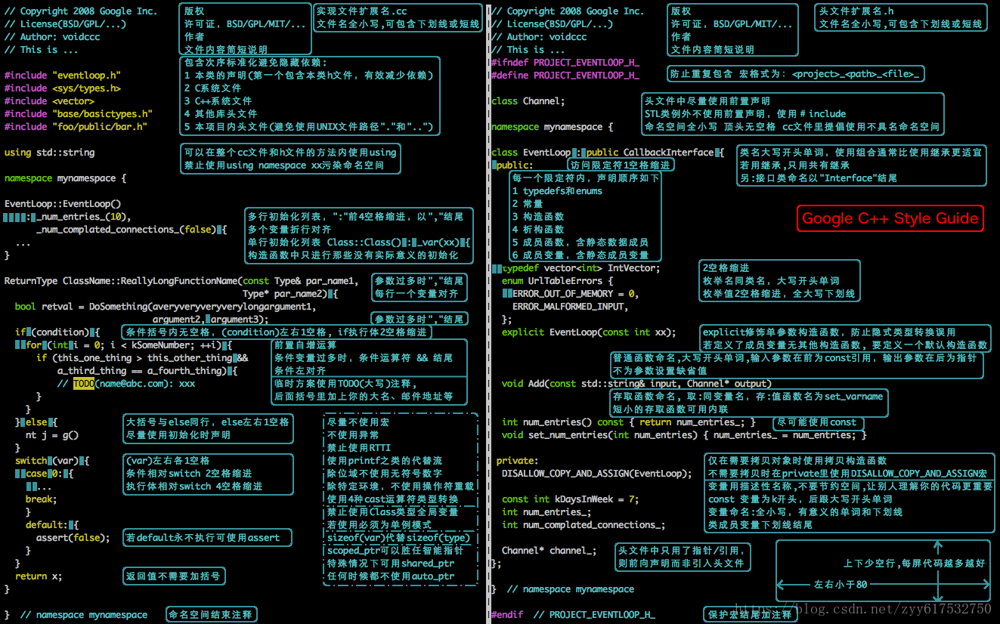

###  C++编程规范与代码风格

####    约定俗成类：

- 使用空格键代替tab键， 行末不应该有空行；

- 函数参数过多时以","结尾换行；条件变量过多时“&&”结尾，条件左对齐

- 条件括号内无空格，（condition）左右1空格，if执行体2空格缩进；

- 大括号与else同行，else左右两边一个空格；

- 普通函数命令，大写开头单词；

- **const变量以k开头，后跟大写开头单词**，const int kDaysInWeek = 7;

- 变量命名：使用描述性名称，尽可能一目了然；

- 变量格式：**全小写，有意义的单词和下划线，类成员变量下划线结尾**；

- switch若default用不执行，可使用assert;

#### 语言特性类：

- 前置自增运算： ++i;

- 尽量不使用宏，不使用异常，**尽量不使用RTTI**（Run-Time Type Information ）

- 使用printf之类的代替流，除位域不适用无符号数字(？)

- 除特定环境，不使用操作符重载；

- **sizeof(var)代替sizeof(type) ;**

- 使用4种cast运算符类型转换；

refs:

1. [google C++ 编程规范](https://zh-google-styleguide.readthedocs.io/en/latest/google-cpp-styleguide/)

