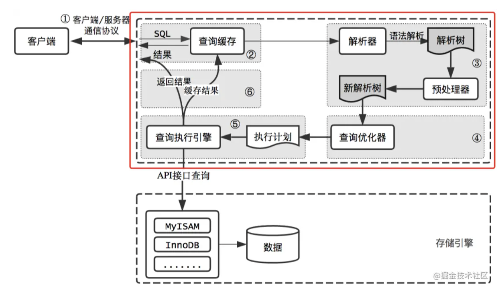

# 1. MySQL体系结构和存储引擎

## 整体架构

<figure>
  
  <figcaption>Fig.1-1 - MySQL基本架构示意图。</figcaption>
</figure>

一次[query过程](https://juejin.cn/post/6844903869474930696)：

<figure>
  
  <figcaption>Fig.1-2 - 查询流程示意图。</figcaption>
</figure>

MySQL由以下几部分组成：

* 连接池组件

  连接、鉴权（check 用户名密码）和权限验证都是在连接器里做的；

  连接有长、短连接之分。建立连接的过程比较复杂，建议使用长连接。

  长连接内存涨的很快：1）定期断开长连接（MySQL释放掉资源）；2）执行`mysql_reset_connection`当前版本 >= 5.7；

* 管理服务和工具组件

* SQL接口组件

* 查询分析器组件

* 优化器组件

* 缓冲（cache）组件

* 插件式存储引擎

  **插件式的表存储引擎**是MySQL区别于其他数据库的一个重要特点。

  存储引擎是基于表的，而不是数据库的。一个数据库下每个表可以有自己的存储引擎。

* 物理文件

## 存储引擎

`show engines\G`可以显示数据库支持的存储引擎。

<figure>
  
  <figcaption>Fig.1-3 - show engines显示的结果。注意到只有InnoDB支持事务。</figcaption>
</figure>

### InnoDB存储引擎

设计目标是线上事务处理**OLTP**（online transaction processing），支持事务。

特点是：行锁设计、支持外键、非锁定读（默认读取操作会产生锁）。

MySQL采用多版本控制MVCC实现高并发性，并且实现了SQL标准的四种隔离标准，默认为**REPEATABLE**级别。同时使用了一种next-key locking 的策略来避免**幻读（phantom）**的产生。

InnoDB还支持：插入缓冲（insert buffer）、二次写（double writer）、自适应哈希索引（adaptive hash index）和预读（read ahead）等高性能和高可用的功能。

### MyISAM存储引擎

设计目标是线上分析处理OLAP（online analysis processing），不支持事务。

表锁设计，支持全文检索。

MyISAM的缓冲池只缓冲索引文件，不缓存数据文件。

### Memory存储引擎

该引擎将表中的数据存放在内存中（一旦重启或者崩溃，表中的数据都将消失）。

适合于存储临时数据。

Memory引擎默认使用哈希索引，而不是B+树。

只支持表锁，并发性能查。

