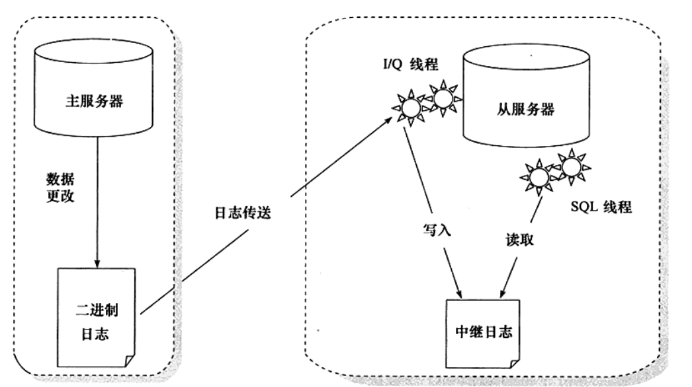
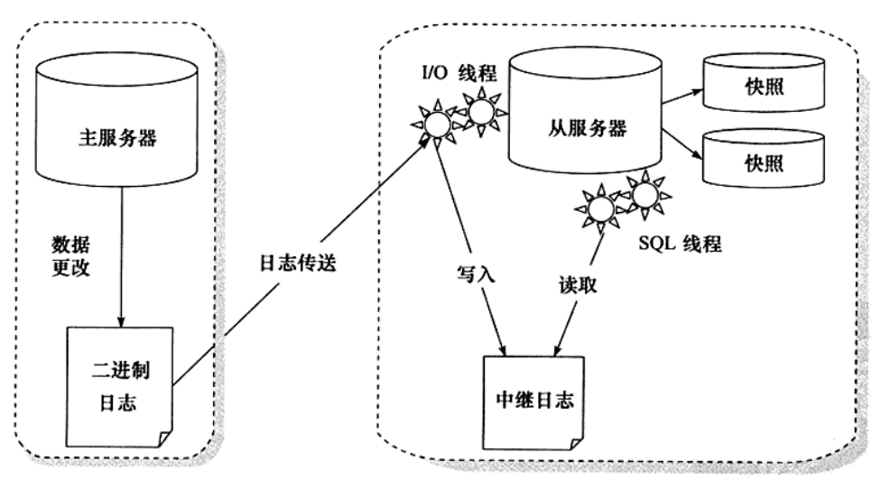

# 8. 备份和恢复

## 二进制文件replication

过程如下：

1）主服务器（master）把数据更改记录到binlog中；

2）从服务器（slave）把二进制文件复制到自己的中继日志（relay log）；

3）从服务器重做中继日志中的日志，将更改应用到数据库。

<figure>
  
  <figcaption>Fig.8-1 主从数据库备份过程。原理就是一个完全备份+二进制日志的增量备份。</figcaption>
</figure>

快照+复制：

复制并不仅仅是用来备份的（必要时可以转化为主服务器，高峰开放访问），并且仅仅用复制来进行备份是不够的。

比如采取了主从复制，主数据库事务`drop table`，从数据库也会被动跟着运行。

<figure>
  
  <figcaption>Fig.8-2 快照+复制。对从服务器数据库所在分区做快照。</figcaption>
</figure>
